<style type="text/css">
.main-container {
  max-width: 1800px;
  margin-left: auto;
  margin-right: auto;
}
</style>
Basic Income Analysis
---------------------

The goal is to extract knowledge on what factors are possibly associated
with the opinions on basic income, based on a dataset provided by Dalia
Research’s poll on basic income in European countries in 2016.
Specifically, the aim of this project is to gain knowledge about the
follwing topics:
<ol>
<li>
How awareness of BI is associated with social status
</li>
<li>
How the thoughts on the effects of BI is associated with social status
</li>
<li>
Whether there is an association between awareness and whether a person
would vote for BI
</li>
<li>
How awareness is related to thoughts on the effects
</li>
<li>
What makes a respondent be for or be against BI
</li>
</ol>
### Import libraries

``` r
library(tidyverse)
library(MASS)
library(nnet)
library(scales)
library(GGally)
```

### Import data

``` r
df = read.csv("basic_income_dataset_dalia.csv")
```

### Define Functions which are going to be used for data preprocesing and other tasks

``` r
length_sum = function(lst){
  return(lst %>%
           sapply(function(x) return(length(x))) %>%
           sum())
}

string_to_lst = function(strings){
  lst = strings %>% sapply(function(st){
    return(strsplit(x=as.character(st), split = " | ", fixed=TRUE))
  })
  return(lst)
}

indicator_category = function(strings, category){
  lst = string_to_lst(strings)
  indicator = rep(0, length(lst))
  for(i in 1:length(lst)){
    if(category %in% lst[[i]]) indicator[i]=1 
  }
  return(indicator)
}

unique_strings = function(strings){
  lst = string_to_lst(strings)
  dat_vec = character(length = length_sum(lst))
  ind = 1
  for(i in 1:length(lst)){
    for(j in 1:length(lst[[i]])){
      dat_vec[ind] = lst[[i]][j]
      ind = ind + 1
    }
  }
  return(unique(dat_vec))
}

pie_chart_generator = function(var_name, facet_col="none", title){
  p = ggplot(df, aes_string(x=factor(1), fill=var_name)) +
    geom_bar(width=1, position = "fill") +
    labs(title=title) +
    coord_polar(theta="y") +
  theme(
    axis.title.x = element_blank(),
    axis.title.y = element_blank(),
    axis.ticks.x = element_blank(),
    axis.ticks.y = element_blank(),
    plot.margin = unit(c(0.1,0.1,0.1,0.1), "mm")
  ) +
    scale_y_continuous(breaks=c(0, 0.25, 0.5, 0.75),
                       labels=percent) 
  if(facet_col %in% colnames(df)){
    if(class(df[,facet_col])=="factor") p = p + facet_grid(reformulate(facet_col, "."))
  }
  return(p)
}

bar_prop_generator = function(fill_var, x_var, title, with_n=TRUE, facet_col="none"){
  p = ggplot(df, aes_string(x=x_var)) + 
      geom_bar(aes_string(fill=fill_var), position="fill") +
      geom_text(aes(label=..count..), stat = "count", position = "fill") +
      labs(title=title, y="prop")
  if(facet_col %in% colnames(df)){
    if(class(df[,facet_col])=="factor") p = p + facet_grid(reformulate(facet_col, "."))
  }
  return(p)
}

reason_plots = function(for_or_against = "for"){
  with_parenthesis = sprintf(" (%s)", for_or_against) 
  vars = colnames(df)[grep(with_parenthesis, colnames(df), fixed=TRUE)]
  reasons_stat = df[,vars] %>% 
    apply(2,sum) %>%
    data.frame()
  colnames(reasons_stat) = "n"
  reasons_stat$reason = rownames(reasons_stat) %>%
   sapply(function(x) return(sub(with_parenthesis, "", x, fixed=TRUE)))
  rownames(reasons_stat) = 1:nrow(reasons_stat)
  num_none_of_the_above = reasons_stat$n[reasons_stat$reason=="None of the above"]
  num_not_none_of_the_above = nrow(df) - num_none_of_the_above
  whether_there_are_reasons = 
    data.frame(response=c("yes", "no"),
              n = c(num_not_none_of_the_above, num_none_of_the_above))
  reasons_stat$prop = reasons_stat$n / num_not_none_of_the_above
  reasons_stat = reasons_stat[,c("reason", "n", "prop")]
  
  plot1 = whether_there_are_reasons %>%
    ggplot(aes(x=response, y=n)) +
    geom_bar(stat="identity") +
    labs(title=sprintf("Number of respondents who did/ did not gave at least one reason for being %s BI", for_or_against))
  
  plot2 = reasons_stat %>%
    ggplot(aes(x=reorder(reason, prop), y=prop)) +
    geom_bar(stat="identity") +
    labs(x="reason", title=sprintf("Reasons for being %s BI", for_or_against)) +
    coord_flip()
  
  return(list(plot1, plot2))
}
```

### Take a quick look at the data

#### Dimension of dataset

``` r
dim(df)
```

    ## [1] 9649   15

#### Names of Columns

``` r
colnames(df)
```

    ##  [1] "country_code"                                        "uuid"                                                "age"                                                 "gender"                                              "rural"                                               "dem_education_level"                                 "dem_full_time_job"                                   "dem_has_children"                                    "question_bbi_2016wave4_basicincome_awareness"        "question_bbi_2016wave4_basicincome_vote"             "question_bbi_2016wave4_basicincome_effect"           "question_bbi_2016wave4_basicincome_argumentsfor"     "question_bbi_2016wave4_basicincome_argumentsagainst" "age_group"                                           "weight"

Since columns related to opinions each have a long name, they can be
shortened.

``` r
c_name_responses = c("awareness", "vote", "effect", "arguments_for",
           "arguments_against")
colnames(df)[9:13] = c_name_responses
colnames(df)
```

    ##  [1] "country_code"        "uuid"                "age"                 "gender"              "rural"               "dem_education_level" "dem_full_time_job"   "dem_has_children"    "awareness"           "vote"                "effect"              "arguments_for"       "arguments_against"   "age_group"           "weight"

#### Take a look at the data

``` r
for(i in 1:ncol(df)){
  cat("\n----", colnames(df)[i], "---- \n")
  for(j in 1:5){
     cat("   ", as.character(df[j, i]), "\n")
  }
}
```

    ## 
    ## ---- country_code ---- 
    ##     AT 
    ##     AT 
    ##     AT 
    ##     AT 
    ##     AT 
    ## 
    ## ---- uuid ---- 
    ##     f6e7ee00-deac-0133-4de8-0a81e8b09a82 
    ##     54f0f1c0-dda1-0133-a559-0a81e8b09a82 
    ##     83127080-da3d-0133-c74f-0a81e8b09a82 
    ##     15626d40-db13-0133-ea5c-0a81e8b09a82 
    ##     24954a70-db98-0133-4a64-0a81e8b09a82 
    ## 
    ## ---- age ---- 
    ##     61 
    ##     57 
    ##     32 
    ##     45 
    ##     41 
    ## 
    ## ---- gender ---- 
    ##     male 
    ##     male 
    ##     male 
    ##     male 
    ##     female 
    ## 
    ## ---- rural ---- 
    ##     rural 
    ##     urban 
    ##     urban 
    ##     rural 
    ##     urban 
    ## 
    ## ---- dem_education_level ---- 
    ##     no 
    ##     high 
    ##     NA 
    ##     high 
    ##     high 
    ## 
    ## ---- dem_full_time_job ---- 
    ##     no 
    ##     yes 
    ##     no 
    ##     yes 
    ##     yes 
    ## 
    ## ---- dem_has_children ---- 
    ##     no 
    ##     yes 
    ##     no 
    ##     yes 
    ##     yes 
    ## 
    ## ---- awareness ---- 
    ##     I know something about it 
    ##     I understand it fully 
    ##     I have heard just a little about it 
    ##     I have heard just a little about it 
    ##     I have heard just a little about it 
    ## 
    ## ---- vote ---- 
    ##     I would not vote 
    ##     I would probably vote for it 
    ##     I would not vote 
    ##     I would probably vote for it 
    ##     I would probably vote for it 
    ## 
    ## ---- effect ---- 
    ##     None of the above 
    ##     A basic income would not affect my work choices 
    ##     ‰Û_ gain additional skills 
    ##     ‰Û_ work less 
    ##     None of the above 
    ## 
    ## ---- arguments_for ---- 
    ##     None of the above 
    ##     It increases appreciation for household work and volunteering | It encourages financial independence and self-responsibility | It reduces anxiety about financing basic needs 
    ##     It creates more equality of opportunity 
    ##     It reduces anxiety about financing basic needs 
    ##     It reduces anxiety about financing basic needs 
    ## 
    ## ---- arguments_against ---- 
    ##     None of the above 
    ##     It might encourage people to stop working 
    ##     Foreigners might come to my country and take advantage of the benefit 
    ##     None of the above 
    ##     It is impossible to finance | It might encourage people to stop working | It increases dependence on the state 
    ## 
    ## ---- age_group ---- 
    ##     40_65 
    ##     40_65 
    ##     26_39 
    ##     40_65 
    ##     40_65 
    ## 
    ## ---- weight ---- 
    ##     1.105.534.474 
    ##     1.533.248.826 
    ##     0.9775919155 
    ##     1.105.534.474 
    ##     58.731.136

It seems values for response-related variables can be fixed so that the
values are not too long and reflect, for arguments\_for and
argements\_against columns, the fact that those are based on multiple
choices of opinions.

### Preprecessing

#### Check for missingness

``` r
df %>%
  apply(2, function(x) sum(is.na(x)))
```

    ##        country_code                uuid                 age              gender               rural dem_education_level   dem_full_time_job    dem_has_children           awareness                vote              effect       arguments_for   arguments_against           age_group              weight 
    ##                   0                   0                   0                   0                   0                 663                   0                   0                   0                   0                   0                   0                   0                   0                   0

Only education level has missing values. For now, let the missing values
for this variable be treated as “unknown”.

``` r
df$dem_education_level = as.character(df$dem_education_level)
df$dem_education_level[is.na(df$dem_education_level)] = "unknown"
df$dem_education_level = factor(df$dem_education_level,
                                   levels=c("unknown", "no", "low", "medium", "high"))
```

#### awareness

Based on the unique values in the awareness column, shown below, values
can be renamed so they are not too long and have no spaces.

``` r
unique(df$awareness)
```

    ## [1] I know something about it           I understand it fully               I have heard just a little about it I have never heard of it           
    ## Levels: I have heard just a little about it I have never heard of it I know something about it I understand it fully

``` r
df$awareness = df$awareness %>%
  sapply(function(x){
    if(x == "I understand it fully"){return("fully_understand")}
    else if(x == "I know something about it"){return("know_something_about_it")}
    else if(x=="I have heard just a little about it"){return("heard_a_little")}
    else{return("never_heard")}
  }) %>%
  factor(levels=c("never_heard", "heard_a_little" , "know_something_about_it", "fully_understand" ))
```

#### Vote

``` r
###vote###
unique(df$vote)
```

    ## [1] I would not vote                 I would probably vote for it     I would vote against it          I would vote for it              I would probably vote against it
    ## Levels: I would not vote I would probably vote against it I would probably vote for it I would vote against it I would vote for it

``` r
df$vote = df$vote %>%
sapply(function(x){
  if(x == "I would vote for it"){return("yes")}
  else if(x == "I would probably vote for it"){return("prob_yes")}
  else if(x=="I would probably vote against it"){return("prob_no")}
  else if(x=="I would vote against it"){return("no")}
  else{return("no_vote")}
}) %>%
  factor(levels=c("no_vote", "no", "prob_no", "prob_yes", "yes"))
```

#### effect

For this variable, the letters “‰Û\_” are included for some of the
observations, which are not neccesary and can be removed.

``` r
unique(df$effect)
```

    ## [1] None of the above                               A basic income would not affect my work choices ‰Û_ gain additional skills                      ‰Û_ work less                                   ‰Û_ work as a freelancer                        ‰Û_ do more volunteering work                   ‰Û_ stop working                                ‰Û_ spend more time with my family              ‰Û_ look for a different job                   
    ## Levels: ‰Û_ do more volunteering work ‰Û_ gain additional skills ‰Û_ look for a different job ‰Û_ spend more time with my family ‰Û_ stop working ‰Û_ work as a freelancer ‰Û_ work less A basic income would not affect my work choices None of the above

``` r
df$effect = df$effect %>% sapply(function(x){
  x = as.character(x)
  sub("‰Û_ ", "", x, fixed=TRUE)
}) %>%
  factor()
```

#### arguments\_for and arguments\_against

For arguments\_for and arguments\_against, since the values are based on
a multiple choice with each of the chosen options separated by the
character \| for each respondent, columns for each option can be created
so that for a respondent, a cell in a column corresponding to one of the
choice options takes 1 if that option is checked and 0 otherwise.

``` r
###arguments_for###
arguments_for_unique = df$arguments_for %>% 
  unique_strings()
for(i in 1:length(arguments_for_unique)){
  df[paste(arguments_for_unique[i], "(for)")] = df$arguments_for %>% 
     indicator_category(category = paste(arguments_for_unique[i]))
}

###arguments_against###
arguments_against_unique = df$arguments_against %>% 
  unique_strings()
for(i in 1:length(arguments_against_unique)){
  df[paste(arguments_against_unique[i], "(against)")] = df$arguments_against %>% 
    indicator_category(category = paste(arguments_against_unique[i]))
}
```

Now, the columns arguments\_for and arguments\_against can be deleted

``` r
df = df[setdiff(colnames(df), c("arguments_for", "arguments_against"))]
```

### Fix factor orderings

For factor variables with more than 2 levels, levels can be possibly
reordered.

#### Create country column

Since there is only variable for country code, creating a culumn for the
country name based on the code could help in making visualization clear
in meaning.

``` r
df$country_code %>% unique()
```

    ##  [1] AT BE BG CY CZ DE DK EE ES FI FR GB GR HR HU IE IT LT LU LV MT NL PL PT RO SE SI SK
    ## Levels: AT BE BG CY CZ DE DK EE ES FI FR GB GR HR HU IE IT LT LU LV MT NL PL PT RO SE SI SK

``` r
map_code_name = list(
  AT = "Austria", BE = "Belgium", BG = "Bulgaria",
  CY = "Cyprus", CZ = "Czechia", DE = "Germany",
  DK = "Denamrk", EE = "Estonia", ES = "Spain",
  FI = "Finland", FR = "France", GB = "Britain",
  GR = "Greece", HR = "Croatia", HU = "Hungary",
  IE = "Ireland", IT = "Italy", LT = "Lithuania",
  LU = "Luxembourg", LV = "Latvia", MT = "Malta",
  NL = "Netherlands", PL = "Poland", PT = "Portugal",
  RO = "Romania", SE = "Sweden", SI = "Slovenia",
  SK = "Slovenia"
)
df$country = sapply(df$country_code, function(x)
  return(map_code_name[[as.character(x)]])) %>% 
  as.factor()
```

In addition to this, countries can be divided based region,

``` r
map_code_region = list(
  AT = "Central", BE = "Western", BG = "Southeastern",
  CY = "Southeastern", CZ = "Central", DE = "Central",
  DK = "Nordic", EE = "Eastern", ES = "Southern",
  FI = "Nordic", FR = "Western", GB = "Western",
  GR = "Southeastern", HR = "Southeastern", HU = "Central",
  IE = "Western", IT = "Southern", LT = "Eastern",
  LU = "Western", LV = "Eastern", MT = "Southern",
  NL = "Western", PL = "Central", PT = "Southern",
  RO = "Southeastern", SE = "Nordic", SI = "Southeastern",
  SK = "Southeastern"
)
df$region = sapply(df$country_code, function(x)
  return(map_code_region[[as.character(x)]])) %>% 
  as.factor()
```

Now take a look at the first six rows again

``` r
for(i in 1:ncol(df)){
  cat("----", colnames(df)[i], "---- \n  ")
  for(j in 1:5){
     cat(as.character(df[j, i]), ",")
  }
  cat(as.character(df[6, i]), "\n\n")
}
```

    ## ---- country_code ---- 
    ##   AT ,AT ,AT ,AT ,AT ,AT 
    ## 
    ## ---- uuid ---- 
    ##   f6e7ee00-deac-0133-4de8-0a81e8b09a82 ,54f0f1c0-dda1-0133-a559-0a81e8b09a82 ,83127080-da3d-0133-c74f-0a81e8b09a82 ,15626d40-db13-0133-ea5c-0a81e8b09a82 ,24954a70-db98-0133-4a64-0a81e8b09a82 ,28583060-dbe2-0133-ff9c-0a81e8b09a82 
    ## 
    ## ---- age ---- 
    ##   61 ,57 ,32 ,45 ,41 ,26 
    ## 
    ## ---- gender ---- 
    ##   male ,male ,male ,male ,female ,female 
    ## 
    ## ---- rural ---- 
    ##   rural ,urban ,urban ,rural ,urban ,rural 
    ## 
    ## ---- dem_education_level ---- 
    ##   no ,high ,unknown ,high ,high ,high 
    ## 
    ## ---- dem_full_time_job ---- 
    ##   no ,yes ,no ,yes ,yes ,yes 
    ## 
    ## ---- dem_has_children ---- 
    ##   no ,yes ,no ,yes ,yes ,no 
    ## 
    ## ---- awareness ---- 
    ##   know_something_about_it ,fully_understand ,heard_a_little ,heard_a_little ,heard_a_little ,fully_understand 
    ## 
    ## ---- vote ---- 
    ##   no_vote ,prob_yes ,no_vote ,prob_yes ,prob_yes ,no 
    ## 
    ## ---- effect ---- 
    ##   None of the above ,A basic income would not affect my work choices ,gain additional skills ,work less ,None of the above ,A basic income would not affect my work choices 
    ## 
    ## ---- age_group ---- 
    ##   40_65 ,40_65 ,26_39 ,40_65 ,40_65 ,26_39 
    ## 
    ## ---- weight ---- 
    ##   1.105.534.474 ,1.533.248.826 ,0.9775919155 ,1.105.534.474 ,58.731.136 ,0.6888730839 
    ## 
    ## ---- None of the above (for) ---- 
    ##   1 ,0 ,0 ,0 ,0 ,0 
    ## 
    ## ---- It increases appreciation for household work and volunteering (for) ---- 
    ##   0 ,1 ,0 ,0 ,0 ,0 
    ## 
    ## ---- It encourages financial independence and self-responsibility (for) ---- 
    ##   0 ,1 ,0 ,0 ,0 ,1 
    ## 
    ## ---- It reduces anxiety about financing basic needs (for) ---- 
    ##   0 ,1 ,0 ,1 ,1 ,1 
    ## 
    ## ---- It creates more equality of opportunity (for) ---- 
    ##   0 ,0 ,1 ,0 ,0 ,0 
    ## 
    ## ---- It reduces bureaucracy and administrative expenses (for) ---- 
    ##   0 ,0 ,0 ,0 ,0 ,0 
    ## 
    ## ---- It increases solidarity, because it is funded by everyone (for) ---- 
    ##   0 ,0 ,0 ,0 ,0 ,0 
    ## 
    ## ---- None of the above (against) ---- 
    ##   1 ,0 ,0 ,1 ,0 ,0 
    ## 
    ## ---- It might encourage people to stop working (against) ---- 
    ##   0 ,1 ,0 ,0 ,1 ,1 
    ## 
    ## ---- Foreigners might come to my country and take advantage of the benefit (against) ---- 
    ##   0 ,0 ,1 ,0 ,0 ,0 
    ## 
    ## ---- It is impossible to finance (against) ---- 
    ##   0 ,0 ,0 ,0 ,1 ,1 
    ## 
    ## ---- It increases dependence on the state (against) ---- 
    ##   0 ,0 ,0 ,0 ,1 ,0 
    ## 
    ## ---- It is against the principle of linking merit and reward (against) ---- 
    ##   0 ,0 ,0 ,0 ,0 ,1 
    ## 
    ## ---- Only the people who need it most should get something from the state (against) ---- 
    ##   0 ,0 ,0 ,0 ,0 ,0 
    ## 
    ## ---- country ---- 
    ##   Austria ,Austria ,Austria ,Austria ,Austria ,Austria 
    ## 
    ## ---- region ---- 
    ##   Central ,Central ,Central ,Central ,Central ,Central

Now, the dataset is in a more analyzable form.

EDA
---

### Respondents’ countries

``` r
df %>% 
  group_by(by=country) %>%
  summarise(n=n()) %>% 
  ggplot(aes(x=reorder(by, n), y=n)) +
  geom_bar(stat="identity") +
  xlab("Country") +
  coord_flip() 
```

    ## `summarise()` ungrouping output (override with `.groups` argument)

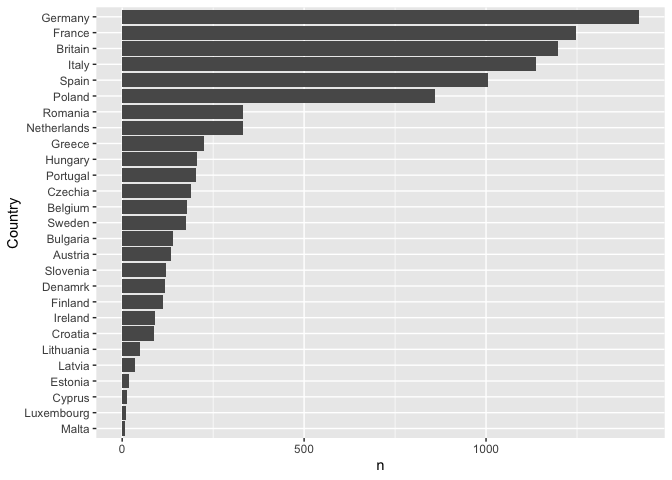

### education levels

``` r
df %>% 
  group_by(by=dem_education_level) %>%
  summarise(n=n()) %>% 
  ggplot(aes(x=by, y=n)) +
  geom_bar(stat="identity") +
  xlab("Education Level") 
```

    ## `summarise()` ungrouping output (override with `.groups` argument)


### education levels and full time job for each gender

``` r
bar_prop_generator("dem_full_time_job", "gender", "dem_full_time_job", with_n=TRUE, facet_col="none")
```

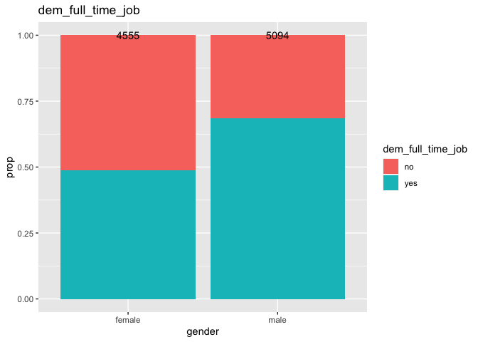

### Awareness

``` r
df %>% 
  group_by(by=awareness) %>%
  summarise(n=n()) %>% 
  ggplot(aes(x=by, y=n)) +
  geom_bar(stat="identity") +
  xlab("Awareness") 
```

    ## `summarise()` ungrouping output (override with `.groups` argument)

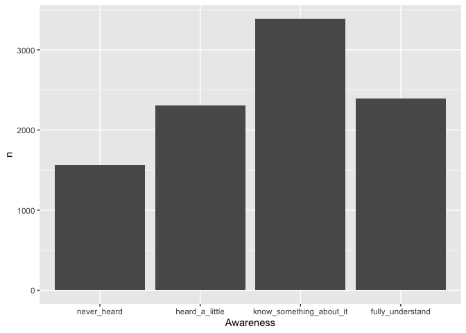

Based on the fact that the majority of the survey respondents fall in
either the category “fully\_understand”or “know\_something\_about\_it”,
it seems that, despite the possibility that the awareness is highly
dependent on other variables, including social status and political and
ecnonomic attributes of a region, BI is overall a well-known idea at
least to some extent.

### Vote

``` r
df %>% 
  group_by(by=vote) %>%
  summarise(n=n()) %>% 
  ggplot(aes(x=by, y=n)) +
  geom_bar(stat="identity") +
  xlab("vote") 
```

    ## `summarise()` ungrouping output (override with `.groups` argument)

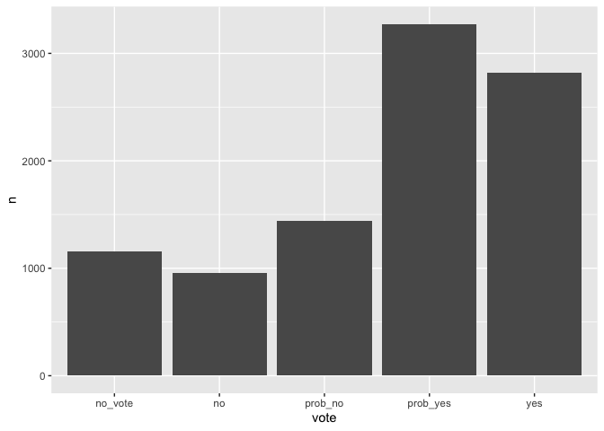

It can be seen that a majority of respondents of the survey at least
probably would vote for BI. Again, this could be dependent on the social
status of a respondent, political or economic attributes of the region
they reside in, etc.

### Reasons for for

``` r
for_plots = reason_plots()
for_plots[[1]]
```

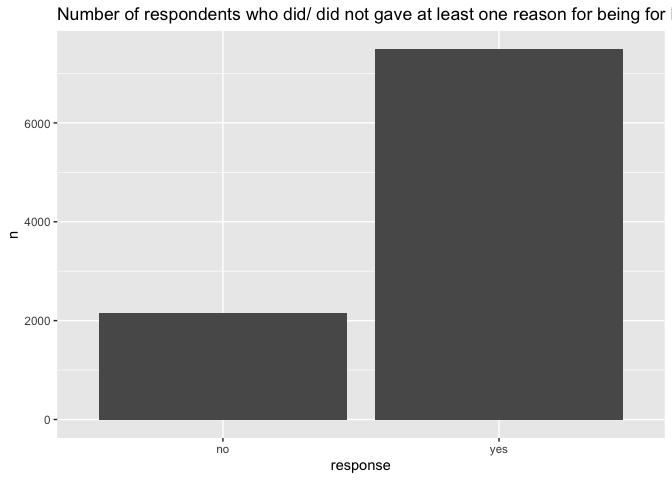

``` r
for_plots[[2]]
```

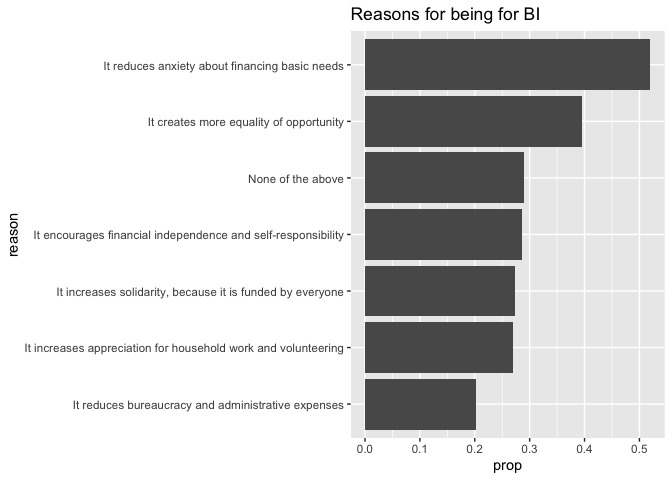

From the above plots, a number of people seem to think BI reduces
financial anxiety.

### Reasons for against

``` r
against_plots = reason_plots("against")
against_plots[[1]]
```

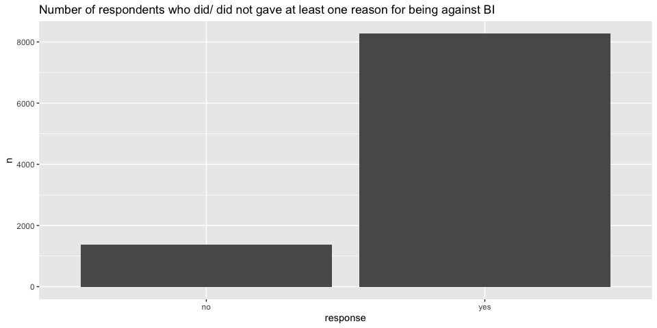

``` r
against_plots[[2]]
```

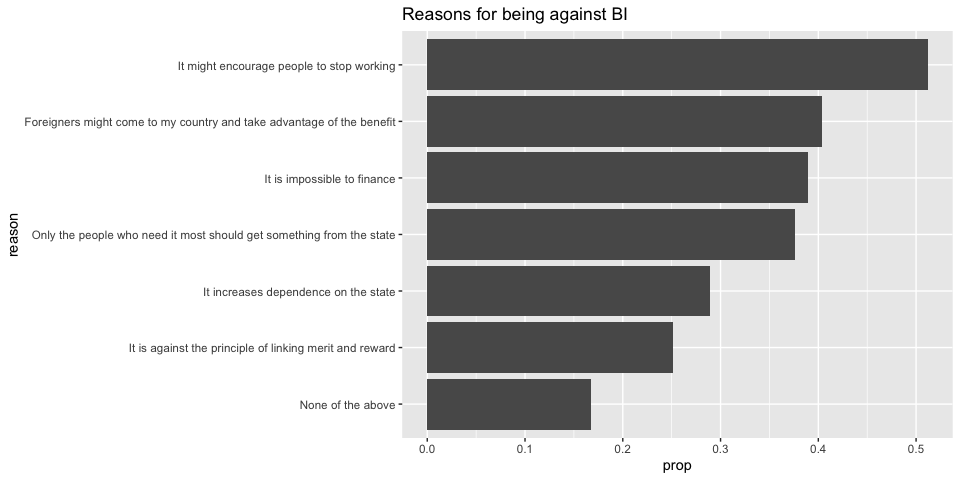

From the above plots, it can be seen that for vast majority of people,
there is at least one reason to be against BI in the answer choices.

### Effect

``` r
df %>%
  group_by(by=effect) %>%
  summarise(n=n()) %>%
  ggplot(aes(x=reorder(by, n), y=n)) +
  geom_bar(stat="identity") +
  labs(title="Opinions on effects",
       x="choice") +
  coord_flip() 
```

    ## `summarise()` ungrouping output (override with `.groups` argument)

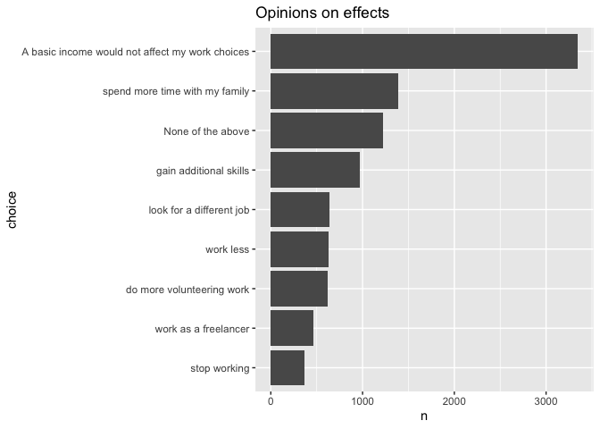

It seems that many of the respondents think BI would not lead to job
loss, and few people think BI would make them stop working.

Answering quastions
-------------------

### 1. How social status is related to whether a person knows about BI

Whether a respondent knows about BI corresponds to the variable
awareness. The variable awareness can be considered an ordinal variable
with the categories, “never\_heard”, “heard\_a\_little”,
“know\_something\_about\_it”, and “fully\_understand”. Firstly, let’s
explore this topic through grapshs.

### Graphical Analysis

##### Plot awareness vs eduction level

``` r
bar_prop_generator("awareness", "dem_education_level", "awareness vs education level")
```

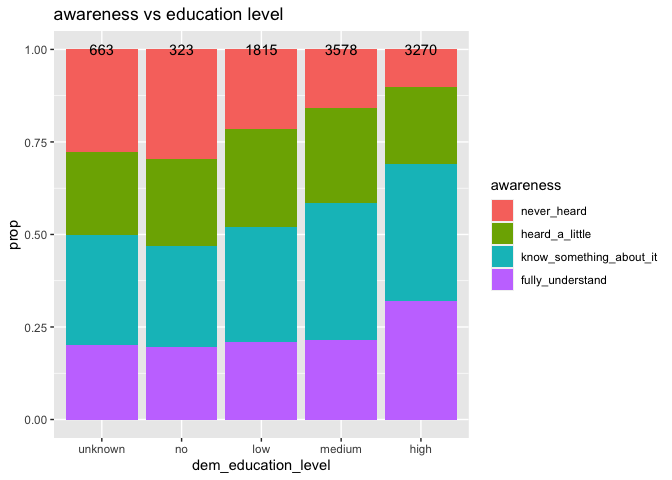

Despite slight differences, people who have a high education level on
average are more knowledgeable in BI. Let’s partition by whether the
resident is rural or urban.

``` r
bar_prop_generator("awareness", "dem_education_level", "awareness vs education level by rural", 
                   facet_col = "rural")
```

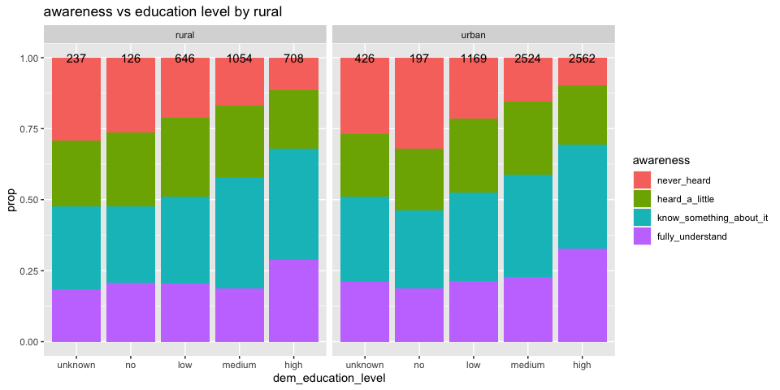

It seems the trend is not that different, and so whether a person lives
in a rural area does not confound the relationship between the education
level and the level of awareness.

##### plot vs age group

``` r
bar_prop_generator("awareness", "age_group", "awareness vs age group")
```

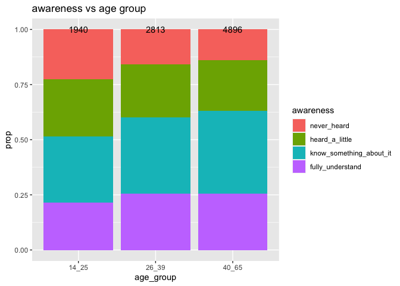

Slightly, people belonging to older age groups seem to be more
knowledgeable in BI.

#### Modelling

For modelling, I will use Generalized Linear Models. Two ways of
treating the variable awareness are considered. First is to treat the
variable as an unordered categorical variable. In this case, multinomial
logit model can be fit. The second way is to treat the variable as an
ordinal variable, with the levels “never\_heard”, “heard\_a\_little”,
“know\_something\_about\_it”, and “fully\_understand”. Cumulative logit
model (proportional/non-proportional odds) is considered in this case.
Models then can be compared, and inferences can be made based on the
best model.

##### Multinomial logit model

Final model is selected based on forward search with the use of
likelihood ratio as the criterion. Two-way interactions are alco taken
into account.

``` r
#age_group, region, gender, rural, dem_education_level, dem_full_time_job, dem_has_children
mod_intercept = multinom(awareness ~ 1, data=df, trace=FALSE)


explanatory_vars = c("age_group", "region", "gender", "rural", 
                     "dem_education_level", "dem_full_time_job", "dem_has_children")
deviance_null = mod_intercept$deviance
edf_null = mod_intercept$edf


formula_right = "1 "
for(i in 1:7){
  p_val = numeric(length(explanatory_vars))
  edf = numeric(length(explanatory_vars))
  dev = numeric(length(explanatory_vars))
  
  for(j in 1:length(explanatory_vars)){
    new_formula_right = paste(formula_right, "+ ", explanatory_vars[j], sep="")
    new_formula_string = paste("awareness ~ ", new_formula_right, sep="")
    mod = multinom(as.formula(new_formula_string), data=df, trace=FALSE)
    dev[j] = mod$deviance
    edf[j] = mod$edf
    p_val[j] = 1 - pchisq(deviance_null - dev[j], df=edf[j] - edf_null)
  }
  
  min_pval_j = which(p_val==min(p_val))[1]
  if(p_val[min_pval_j] < 0.05){
    formula_right = paste(formula_right, " + ", explanatory_vars[min_pval_j], sep="")
    explanatory_vars = explanatory_vars[-min_pval_j]
    deviance_null = dev[min_pval_j]
    edf_null = edf[min_pval_j]
  }else{
    break
  }
}

cat("The final main effects model is", formula_right, ".")
```

    ## The final main effects model is 1  + age_group + region + dem_education_level + gender + dem_full_time_job .

``` r
mod_main_effects = 
  multinom(awareness ~ 1  + age_group + region + dem_education_level + gender + dem_full_time_job,
           data=df, trace=FALSE)
deviance_null = mod_main_effects$deviance
edf_null = mod_main_effects$edf


explanatory_vars = c("age_group", "region", "dem_education_level", "gender", "dem_full_time_job")
interaction_formulas = character(10)
k=1
for(i in 1:4){
  for(j in (i+1):5){
    interaction_formulas[k] = paste(explanatory_vars[i], ":", explanatory_vars[j], sep="")
    k = k + 1
  }
}


formula_right = "1  + age_group + region + dem_education_level + gender + dem_full_time_job"
for(i in 1:10){
  p_val = numeric(length(interaction_formulas))
  edf = numeric(length(interaction_formulas))
  dev = numeric(length(interaction_formulas))
  
  for(j in 1:length(interaction_formulas)){
    new_formula_right = paste(formula_right, "+ ", interaction_formulas[j], sep="")
    new_formula_string = paste("awareness ~ ", new_formula_right, sep="")
    mod = multinom(as.formula(new_formula_string), data=df, trace=FALSE)
    dev[j] = mod$deviance
    edf[j] = mod$edf
    p_val[j] = 1 - pchisq(deviance_null - dev[j], df=edf[j] - edf_null)
  }
  
  min_pval_j = which(p_val==min(p_val))[1]
  if(p_val[min_pval_j] < 0.05){
    formula_right = paste(formula_right, " + ", interaction_formulas[min_pval_j], sep="")
    interaction_formulas = interaction_formulas[-min_pval_j]
    deviance_null = dev[min_pval_j]
    edf_null = edf[min_pval_j]
  }else{
    break
  }
}

cat("The final second order model is", formula_right, ".")
```

    ## The final second order model is 1  + age_group + region + dem_education_level + gender + dem_full_time_job + age_group:region + region:dem_education_level .

``` r
mod_formula = paste("awareness ~ ", formula_right, sep="")
mod_second_order = multinom(as.formula(mod_formula), data=df, trace=FALSE)
anova(mod_main_effects, mod_second_order)
```

    ## Likelihood ratio tests of Multinomial Models
    ## 
    ## Response: awareness
    ##                                                                                                                       Model Resid. df Resid. Dev   Test    Df LR stat.      Pr(Chi)
    ## 1                                                 1 + age_group + region + dem_education_level + gender + dem_full_time_job     28905   25330.66                                   
    ## 2 1 + age_group + region + dem_education_level + gender + dem_full_time_job + age_group:region + region:dem_education_level     28815   25188.38 1 vs 2    90 142.2808 0.0003710489

Comparing the final main effects model and the second order model, based
on the p-value of the likelihood ratio test, the second-order model can
be taken as the final model.

``` r
mod_second_order
```

    ## Call:
    ## multinom(formula = as.formula(mod_formula), data = df, trace = FALSE)
    ## 
    ## Coefficients:
    ##                         (Intercept) age_group26_39 age_group40_65 regionEastern regionNordic regionSoutheastern regionSouthern regionWestern dem_education_levelno dem_education_levellow dem_education_levelmedium dem_education_levelhigh gendermale dem_full_time_jobyes age_group26_39:regionEastern age_group40_65:regionEastern age_group26_39:regionNordic age_group40_65:regionNordic age_group26_39:regionSoutheastern age_group40_65:regionSoutheastern age_group26_39:regionSouthern age_group40_65:regionSouthern age_group26_39:regionWestern age_group40_65:regionWestern regionEastern:dem_education_levelno regionNordic:dem_education_levelno regionSoutheastern:dem_education_levelno regionSouthern:dem_education_levelno regionWestern:dem_education_levelno regionEastern:dem_education_levellow regionNordic:dem_education_levellow regionSoutheastern:dem_education_levellow regionSouthern:dem_education_levellow regionWestern:dem_education_levellow regionEastern:dem_education_levelmedium
    ## heard_a_little           0.03648216     0.14279718      0.1141684    -0.1306594    -1.664935        -1.59597794     -0.3353328   -0.47814785            0.00380109              0.1962776                 0.3877835               0.6360581 0.01445512          -0.03621581                   -1.2876662                    0.9958970                   0.4427170                  0.45083308                         0.2273244                         0.3281186                   -0.04683155                     0.1625379                   0.07806827                    0.3436556                           0.5340587                          0.6992303                               0.05351958                           -0.6200436                          0.01164618                          -0.06211252                         1.204193222                                1.00175733                             0.4004899                           0.03259183                               0.3496999
    ## know_something_about_it -0.02438033     0.02313485      0.2679326     0.2665238    -1.103244        -0.38970302     -0.6607923   -0.56619291           -0.14674870              0.1766758                 0.4301816               0.8319470 0.32937936           0.08470270                   -0.9695256                    0.9190095                   0.1447802                  0.06103491                         0.8092758                         0.3891753                    0.42715645                     0.7572957                   0.31212368                    0.2276097                          -0.6501121                          0.1860747                              -0.27288718                           -0.7270765                          0.40872979                          -0.66651854                         0.001137417                                0.02330288                             0.3110198                           0.03587962                              -0.7918426
    ## fully_understand        -0.70283787    -0.03217709     -0.1007688     1.1531551    -1.263319         0.08139353     -0.5891558   -0.07951095            0.02041549              0.2584657                 0.2164955               0.9796306 0.39201783           0.27543155                   -0.5267661                    1.2359383                   0.5045801                  0.78699171                         0.7765932                         0.5198989                    0.34092955                     1.0134910                   0.23067084                    0.5448269                          -0.5242984                         -1.7793926                              -0.23524658                           -0.8780918                          0.35751458                          -1.48525057                         1.004588629                                0.07864283                             0.5354388                          -0.32601476                              -0.9404246
    ##                         regionNordic:dem_education_levelmedium regionSoutheastern:dem_education_levelmedium regionSouthern:dem_education_levelmedium regionWestern:dem_education_levelmedium regionEastern:dem_education_levelhigh regionNordic:dem_education_levelhigh regionSoutheastern:dem_education_levelhigh regionSouthern:dem_education_levelhigh regionWestern:dem_education_levelhigh
    ## heard_a_little                                       0.9420815                                   0.76454699                                0.4550764                               0.3067765                             0.5534100                           0.69398474                                  1.2169888                              0.5631171                             0.1666715
    ## know_something_about_it                              0.6206776                                  -0.19876625                                0.5960876                               0.4255078                             0.6346846                           0.01466665                                  0.1460234                              0.8028643                             0.3964550
    ## fully_understand                                     0.8135223                                   0.09659684                                0.9065837                               0.3119101                             0.5611440                           0.44743452                                  0.3061765                              1.2333427                             0.0533746
    ## 
    ## Residual Deviance: 25188.38 
    ## AIC: 25452.38

### 2. How notion on the effects of BI is associated with social status

#### Graphical Analysis

##### Plot

``` r
colnames(df)
```

    ##  [1] "country_code"                                                                    "uuid"                                                                            "age"                                                                             "gender"                                                                          "rural"                                                                           "dem_education_level"                                                             "dem_full_time_job"                                                               "dem_has_children"                                                                "awareness"                                                                       "vote"                                                                            "effect"                                                                          "age_group"                                                                      
    ## [13] "weight"                                                                          "None of the above (for)"                                                         "It increases appreciation for household work and volunteering (for)"             "It encourages financial independence and self-responsibility (for)"              "It reduces anxiety about financing basic needs (for)"                            "It creates more equality of opportunity (for)"                                   "It reduces bureaucracy and administrative expenses (for)"                        "It increases solidarity, because it is funded by everyone (for)"                 "None of the above (against)"                                                     "It might encourage people to stop working (against)"                             "Foreigners might come to my country and take advantage of the benefit (against)" "It is impossible to finance (against)"                                          
    ## [25] "It increases dependence on the state (against)"                                  "It is against the principle of linking merit and reward (against)"               "Only the people who need it most should get something from the state (against)"  "country"                                                                         "region"

``` r
bar_prop_generator("effect", "age_group", "effect vs age group", facet_col="gender")
```

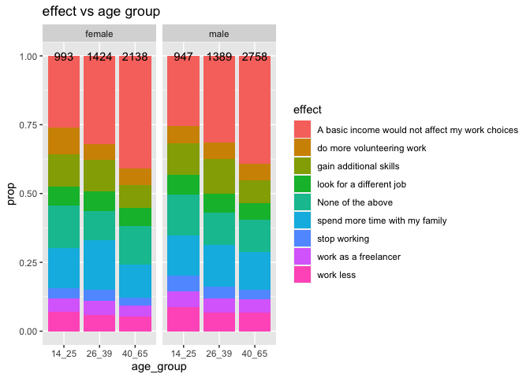

``` r
bar_prop_generator("effect", "dem_education_level", "effect vs age group")
```

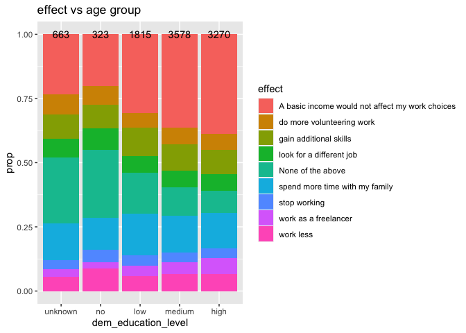

##### Modelling

``` r
mod_effect = multinom(effect ~ age_group + region + gender + rural + 
                        dem_education_level + dem_full_time_job +  dem_has_children,
                      data=df, trace=FALSE)
mod_effect
```

    ## Call:
    ## multinom(formula = effect ~ age_group + region + gender + rural + 
    ##     dem_education_level + dem_full_time_job + dem_has_children, 
    ##     data = df, trace = FALSE)
    ## 
    ## Coefficients:
    ##                                (Intercept) age_group26_39 age_group40_65 regionEastern  regionNordic regionSoutheastern regionSouthern regionWestern  gendermale  ruralurban dem_education_levelno dem_education_levellow dem_education_levelmedium dem_education_levelhigh dem_full_time_jobyes dem_has_childrenyes
    ## do more volunteering work       -0.9593504    -0.35839868     -0.5221405     0.2772222  0.0005344373        0.303233205      0.2623311    0.23723129 -0.07680663  0.28519510            0.17124558           -0.512682381               -0.51316763              -0.6192763          -0.19264730         -0.18973294
    ## gain additional skills          -0.7317274     0.07648363     -0.4633992     0.4459720  0.0172769906       -0.036317078     -0.4305239    0.17623571  0.04573123  0.22834161            0.11575434           -0.007651468               -0.20229833              -0.3618546          -0.11179805         -0.34236014
    ## look for a different job        -1.2070461    -0.13838798     -0.4951532     0.6068405 -0.3476427180        0.063987669      0.1978584    0.52885673 -0.04083968  0.10289376            0.33843076           -0.354832799               -0.53299419              -0.6869383           0.20879307         -0.10957515
    ## None of the above                0.3797631    -0.16468140     -0.3313063     0.5647496 -0.0445491163       -0.000726233     -0.2154989    0.34518816  0.01109778 -0.04146981            0.18147779           -0.686681779               -1.12931939              -1.3856189          -0.32821004         -0.11129495
    ## spend more time with my family  -0.4037322    -0.16994711     -0.7436910     0.6688693 -0.3945521890       -0.061937256     -0.3089594    0.04832668  0.03483688  0.14393694            0.05651460           -0.108380463               -0.41683316              -0.5747031           0.07435489          0.42516063
    ## stop working                    -1.6864155    -0.31463897     -0.7679944     0.1478993  0.1690415835       -0.416160856     -0.2619736   -0.18578389  0.23948594  0.22981665            0.55211192           -0.047346288               -0.25399099              -0.2592496           0.01902249         -0.04454982
    ## work as a freelancer            -1.9618438    -0.11612019     -0.4519677     0.4837884  0.4128772273        0.367590072      0.1233275    0.01841245  0.20344939  0.19323875           -0.05325097            0.093892641                0.09385219               0.3389524          -0.31587922         -0.18796436
    ## work less                       -1.2421554    -0.44133454     -0.6948525     0.7117279  0.2749377760       -0.318191389     -0.5338769    0.02513800  0.15633558  0.14005166            0.59743706           -0.141480891               -0.18246775              -0.2789970           0.35625948         -0.10976545
    ## 
    ## Residual Deviance: 36683.49 
    ## AIC: 36939.49

``` r
table(df$effect, predict(mod_effect))
```

    ##                                                  
    ##                                                   A basic income would not affect my work choices do more volunteering work gain additional skills look for a different job None of the above spend more time with my family stop working work as a freelancer work less
    ##   A basic income would not affect my work choices                                            3171                         0                      0                        0               147                             31            0                    0         0
    ##   do more volunteering work                                                                   550                         0                      0                        0                60                              5            0                    0         0
    ##   gain additional skills                                                                      886                         0                      0                        0                72                             12            0                    0         0
    ##   look for a different job                                                                    577                         0                      0                        0                55                              8            0                    0         0
    ##   None of the above                                                                          1011                         0                      0                        0               195                             21            0                    0         0
    ##   spend more time with my family                                                             1263                         0                      0                        0               102                             22            0                    0         0
    ##   stop working                                                                                332                         0                      0                        0                31                              4            0                    0         0
    ##   work as a freelancer                                                                        440                         0                      0                        0                22                              3            0                    0         0
    ##   work less                                                                                   569                         0                      0                        0                51                              9            0                    0         0

### 3. Whether there is an association between awareness and whether a person would vote for BI

``` r
table_mat = as.matrix(table(df$awareness, df$vote))
nums_vote = apply(table_mat, 1, sum)
mat_nums_awareness = nums_vote %*%  matrix(1, ncol=length(unique(df$vote)), nrow=1)
table_mat/mat_nums_awareness
```

    ##                          
    ##                              no_vote         no    prob_no   prob_yes        yes
    ##   never_heard             0.35185185 0.09578544 0.12515964 0.22605364 0.20114943
    ##   heard_a_little          0.12364425 0.11019523 0.18698482 0.37266811 0.20650759
    ##   know_something_about_it 0.06757156 0.09235763 0.16819121 0.40985541 0.26202420
    ##   fully_understand        0.03934701 0.10171620 0.10129761 0.28045207 0.47718711

``` r
kendalls_tau = function(t, type="a"){
  
}
```

### 4. How awareness is related to thoughts on the effects

``` r
chisq.test(table(df$effect, df$awareness))
```

    ## 
    ##  Pearson's Chi-squared test
    ## 
    ## data:  table(df$effect, df$awareness)
    ## X-squared = 728.72, df = 24, p-value < 2.2e-16

``` r
table_mat = as.matrix(table(df$effect, df$awareness))
nums_awareness = apply(table_mat, 2, sum)
mat_nums_awareness = matrix(1, nrow=length(unique(df$effect)), ncol=1) %*% t(nums_awareness)
table_mat/mat_nums_awareness
```

    ##                                                  
    ##                                                   never_heard heard_a_little know_something_about_it fully_understand
    ##   A basic income would not affect my work choices  0.26436782     0.34013015              0.36441428       0.38342403
    ##   do more volunteering work                        0.04342273     0.05466377              0.07111242       0.07534533
    ##   gain additional skills                           0.07215837     0.09978308              0.11655356       0.09711176
    ##   look for a different job                         0.05172414     0.07288503              0.06373562       0.07325241
    ##   None of the above                                0.32503193     0.11757050              0.07819416       0.07618250
    ##   spend more time with my family                   0.11366539     0.15748373              0.15845382       0.12934282
    ##   stop working                                     0.03703704     0.04034707              0.03275302       0.04395144
    ##   work as a freelancer                             0.03384419     0.04728850              0.05193272       0.05316032
    ##   work less                                        0.05874840     0.06984816              0.06285040       0.06822938

### 5. What are the possible reasons for a respondent to be for or against BI
