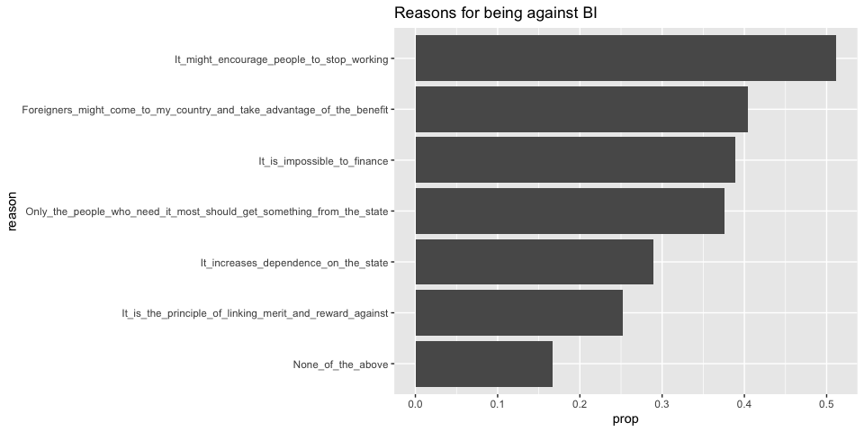
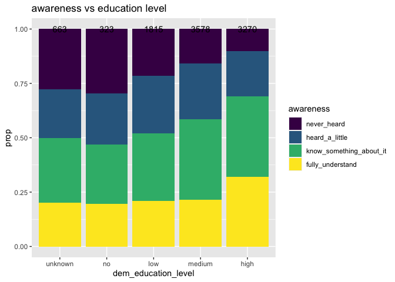
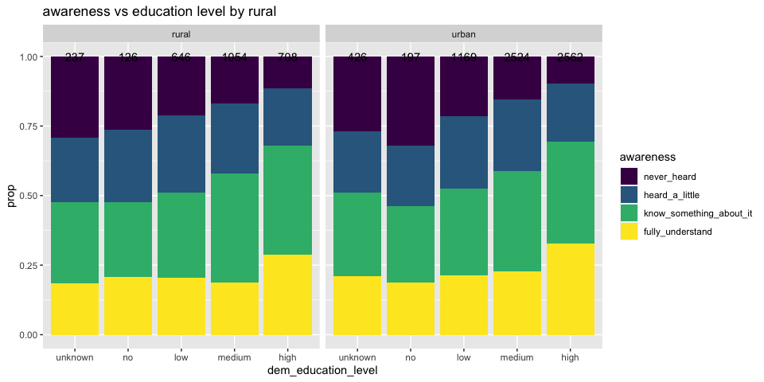
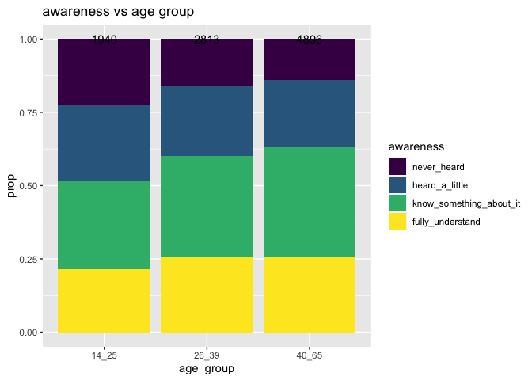
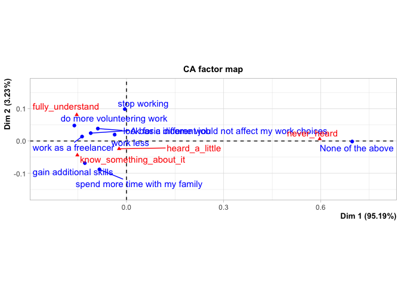
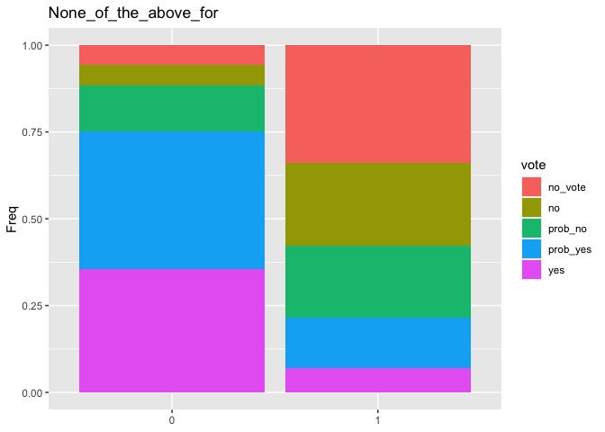

<style type="text/css">
.main-container {
  max-width: 1800px;
  margin-left: auto;
  margin-right: auto;
}
</style>


## Basic Income Analysis
The goal is to extract knowledge on what factors are possibly associated with the opinions on basic income, based on a dataset provided by Dalia Research's poll on basic income in European countries in 2016. Specifically, the aim of this project is to gain knowledge about the follwing topics:
<ol>
  <li>How awareness of BI is associated with socio-economic factors</li>
  <li>How the thoughts on the effects of BI is associated with socio-economic factors</li>
  <li>Whether there is an association between awareness and whether a person would vote for BI</li>
  <li>What makes a respondent be for or be against BI </li>
</ol>

### Import libraries

```r
library(tidyverse)
library(MASS)
library(nnet)
library(scales)
library(GGally)
library(VGAM)
```

### Import data

```r
df = read.csv("basic_income_dataset_dalia.csv")
```

### Define Functions which are going to be used for data preprocesing and other tasks

```r
length_sum = function(lst){
  return(lst %>%
           sapply(function(x) return(length(x))) %>%
           sum())
}

string_to_lst = function(strings){
  lst = strings %>% sapply(function(st){
    return(strsplit(x=as.character(st), split = " | ", fixed=TRUE))
  })
  return(lst)
}

indicator_category = function(strings, category){
  lst = string_to_lst(strings)
  indicator = rep(0, length(lst))
  for(i in 1:length(lst)){
    if(category %in% lst[[i]]) indicator[i]=1 
  }
  return(indicator)
}

unique_strings = function(strings){
  lst = string_to_lst(strings)
  dat_vec = character(length = length_sum(lst))
  ind = 1
  for(i in 1:length(lst)){
    for(j in 1:length(lst[[i]])){
      dat_vec[ind] = lst[[i]][j]
      ind = ind + 1
    }
  }
  return(unique(dat_vec))
}

pie_chart_generator = function(var_name, facet_col="none", title){
  p = ggplot(df, aes_string(x=factor(1), fill=var_name)) +
    geom_bar(width=1, position = "fill") +
    labs(title=title) +
    coord_polar(theta="y") +
  theme(
    axis.title.x = element_blank(),
    axis.title.y = element_blank(),
    axis.ticks.x = element_blank(),
    axis.ticks.y = element_blank(),
    plot.margin = unit(c(0.1,0.1,0.1,0.1), "mm")
  ) +
    scale_y_continuous(breaks=c(0, 0.25, 0.5, 0.75),
                       labels=percent) 
  if(facet_col %in% colnames(df)){
    if(class(df[,facet_col])=="factor") p = p + facet_grid(reformulate(facet_col, "."))
  }
  return(p)
}

bar_prop_generator = function(fill_var, x_var, title, with_n=TRUE, facet_col="none"){
  p = ggplot(df, aes_string(x=x_var)) + 
      geom_bar(aes_string(fill=fill_var), position="fill") +
      geom_text(aes(label=..count..), stat = "count", position = "fill") +
      labs(title=title, y="prop")
  if(facet_col %in% colnames(df)){
    if(class(df[,facet_col])=="factor") p = p + facet_grid(reformulate(facet_col, "."))
  }
  return(p)
}

reason_plots = function(for_or_against = "for"){
  with_parenthesis = sprintf("_%s", for_or_against) 
  vars = colnames(df)[grep(with_parenthesis, colnames(df), fixed=TRUE)]
  reasons_stat = df[,vars] %>% 
    apply(2,sum) %>%
    data.frame()
  colnames(reasons_stat) = "n"
  reasons_stat$reason = rownames(reasons_stat) %>%
   sapply(function(x) return(sub(with_parenthesis, "", x, fixed=TRUE)))
  rownames(reasons_stat) = 1:nrow(reasons_stat)
  num_none_of_the_above = reasons_stat$n[reasons_stat$reason=="None_of_the_above"]
  num_not_none_of_the_above = nrow(df) - num_none_of_the_above
  whether_there_are_reasons = 
    data.frame(response=c("yes", "no"),
              n = c(num_not_none_of_the_above, num_none_of_the_above))
  reasons_stat$prop = reasons_stat$n / num_not_none_of_the_above
  reasons_stat = reasons_stat[,c("reason", "n", "prop")]
  
  plot1 = whether_there_are_reasons %>%
    ggplot(aes(x=response, y=n)) +
    geom_bar(stat="identity") +
    labs(title=sprintf("Number of respondents who did/ did not gave at least one reason for being %s BI", for_or_against))
  
  plot2 = reasons_stat %>%
    ggplot(aes(x=reorder(reason, prop), y=prop)) +
    geom_bar(stat="identity") +
    labs(x="reason", title=sprintf("Reasons for being %s BI", for_or_against)) +
    coord_flip()
  
  return(list(plot1, plot2))
}
```

### Take a quick look at the data
#### Dimension of dataset

```r
dim(df)
```

```
## [1] 9649   15
```

#### Names of Columns

```r
colnames(df)
```

```
##  [1] "country_code"                                        "uuid"                                                "age"                                                 "gender"                                              "rural"                                               "dem_education_level"                                 "dem_full_time_job"                                   "dem_has_children"                                    "question_bbi_2016wave4_basicincome_awareness"        "question_bbi_2016wave4_basicincome_vote"             "question_bbi_2016wave4_basicincome_effect"           "question_bbi_2016wave4_basicincome_argumentsfor"     "question_bbi_2016wave4_basicincome_argumentsagainst" "age_group"                                           "weight"
```

Since columns related to opinions each have a long name, they can be shortened.

```r
c_name_responses = c("awareness", "vote", "effect", "arguments_for",
           "arguments_against")
colnames(df)[9:13] = c_name_responses
colnames(df)
```

```
##  [1] "country_code"        "uuid"                "age"                 "gender"              "rural"               "dem_education_level" "dem_full_time_job"   "dem_has_children"    "awareness"           "vote"                "effect"              "arguments_for"       "arguments_against"   "age_group"           "weight"
```

#### Take a look at the data

```r
for(i in 1:ncol(df)){
  cat("\n----", colnames(df)[i], "---- \n")
  for(j in 1:5){
     cat("   ", as.character(df[j, i]), "\n")
  }
}
```

```
## 
## ---- country_code ---- 
##     AT 
##     AT 
##     AT 
##     AT 
##     AT 
## 
## ---- uuid ---- 
##     f6e7ee00-deac-0133-4de8-0a81e8b09a82 
##     54f0f1c0-dda1-0133-a559-0a81e8b09a82 
##     83127080-da3d-0133-c74f-0a81e8b09a82 
##     15626d40-db13-0133-ea5c-0a81e8b09a82 
##     24954a70-db98-0133-4a64-0a81e8b09a82 
## 
## ---- age ---- 
##     61 
##     57 
##     32 
##     45 
##     41 
## 
## ---- gender ---- 
##     male 
##     male 
##     male 
##     male 
##     female 
## 
## ---- rural ---- 
##     rural 
##     urban 
##     urban 
##     rural 
##     urban 
## 
## ---- dem_education_level ---- 
##     no 
##     high 
##     NA 
##     high 
##     high 
## 
## ---- dem_full_time_job ---- 
##     no 
##     yes 
##     no 
##     yes 
##     yes 
## 
## ---- dem_has_children ---- 
##     no 
##     yes 
##     no 
##     yes 
##     yes 
## 
## ---- awareness ---- 
##     I know something about it 
##     I understand it fully 
##     I have heard just a little about it 
##     I have heard just a little about it 
##     I have heard just a little about it 
## 
## ---- vote ---- 
##     I would not vote 
##     I would probably vote for it 
##     I would not vote 
##     I would probably vote for it 
##     I would probably vote for it 
## 
## ---- effect ---- 
##     None of the above 
##     A basic income would not affect my work choices 
##     ‰Û_ gain additional skills 
##     ‰Û_ work less 
##     None of the above 
## 
## ---- arguments_for ---- 
##     None of the above 
##     It increases appreciation for household work and volunteering | It encourages financial independence and self-responsibility | It reduces anxiety about financing basic needs 
##     It creates more equality of opportunity 
##     It reduces anxiety about financing basic needs 
##     It reduces anxiety about financing basic needs 
## 
## ---- arguments_against ---- 
##     None of the above 
##     It might encourage people to stop working 
##     Foreigners might come to my country and take advantage of the benefit 
##     None of the above 
##     It is impossible to finance | It might encourage people to stop working | It increases dependence on the state 
## 
## ---- age_group ---- 
##     40_65 
##     40_65 
##     26_39 
##     40_65 
##     40_65 
## 
## ---- weight ---- 
##     1.105.534.474 
##     1.533.248.826 
##     0.9775919155 
##     1.105.534.474 
##     58.731.136
```

It seems values of response-related variables can be fixed so that the values are not too long and reflect, for arguments_for and argements_against columns, 
the fact that those are based on multiple choices of opinions.

### Preprecessing
#### Check for missingness

```r
df %>%
  apply(2, function(x) sum(is.na(x)))
```

```
##        country_code                uuid                 age              gender               rural dem_education_level   dem_full_time_job    dem_has_children           awareness                vote              effect       arguments_for   arguments_against           age_group              weight 
##                   0                   0                   0                   0                   0                 663                   0                   0                   0                   0                   0                   0                   0                   0                   0
```

Only education level has missing values. For now, let the missing values for this variable be treated as "unknown".


```r
df$dem_education_level = as.character(df$dem_education_level)
df$dem_education_level[is.na(df$dem_education_level)] = "unknown"
df$dem_education_level = factor(df$dem_education_level,
                                   levels=c("unknown", "no", "low", "medium", "high"))
```


#### awareness
Based on the unique values in the awareness column, shown below, values can be renamed so they are not too long and have no spaces.

```r
unique(df$awareness)
```

```
## [1] I know something about it           I understand it fully               I have heard just a little about it I have never heard of it           
## Levels: I have heard just a little about it I have never heard of it I know something about it I understand it fully
```

```r
df$awareness = df$awareness %>%
  sapply(function(x){
    if(x == "I understand it fully"){return("fully_understand")}
    else if(x == "I know something about it"){return("know_something_about_it")}
    else if(x=="I have heard just a little about it"){return("heard_a_little")}
    else{return("never_heard")}
  }) %>%
  factor(levels=c("never_heard", "heard_a_little" , "know_something_about_it", "fully_understand" ), ordered=TRUE)
```

#### Vote

```r
###vote###
unique(df$vote)
```

```
## [1] I would not vote                 I would probably vote for it     I would vote against it          I would vote for it              I would probably vote against it
## Levels: I would not vote I would probably vote against it I would probably vote for it I would vote against it I would vote for it
```

```r
df$vote = df$vote %>%
sapply(function(x){
  if(x == "I would vote for it"){return("yes")}
  else if(x == "I would probably vote for it"){return("prob_yes")}
  else if(x=="I would probably vote against it"){return("prob_no")}
  else if(x=="I would vote against it"){return("no")}
  else{return("no_vote")}
}) %>%
  factor(levels=c("no_vote", "no", "prob_no", "prob_yes", "yes"))
```

#### effect
For this variable, the letters "‰Û_ " are included in some of the observations, which are not neccesary and can be removed.

```r
unique(df$effect)
```

```
## [1] None of the above                               A basic income would not affect my work choices ‰Û_ gain additional skills                      ‰Û_ work less                                   ‰Û_ work as a freelancer                        ‰Û_ do more volunteering work                   ‰Û_ stop working                                ‰Û_ spend more time with my family              ‰Û_ look for a different job                   
## Levels: ‰Û_ do more volunteering work ‰Û_ gain additional skills ‰Û_ look for a different job ‰Û_ spend more time with my family ‰Û_ stop working ‰Û_ work as a freelancer ‰Û_ work less A basic income would not affect my work choices None of the above
```

```r
df$effect = df$effect %>% sapply(function(x){
  x = as.character(x)
  sub("‰Û_ ", "", x, fixed=TRUE)
}) %>%
  factor()
```

#### arguments_for and arguments_against
For arguments_for and arguments_against, since the values are based on a multiple choice with each of the chosen options separated by the character "|", columns for each option can be created so that for each of the respondents, a cell in a column corresponding to one of the choice options takes 1 if that option is checked and 0 otherwise.

```r
###arguments_for###
arguments_for_unique = df$arguments_for %>% 
  unique_strings()
for(i in 1:length(arguments_for_unique)){
  df[gsub(" ", "_", paste(arguments_for_unique[i], "for"))] = df$arguments_for %>% 
     indicator_category(category = paste(arguments_for_unique[i]))
}
colnames(df)[grep("_for", colnames(df))] = 
  gsub("[,-]", "", colnames(df)[grep("_for", colnames(df))])

###arguments_against###
arguments_against_unique = df$arguments_against %>% 
  unique_strings()
for(i in 1:length(arguments_against_unique)){
  df[gsub(" ", "_", paste(arguments_against_unique[i], "against"))] = df$arguments_against %>% 
    indicator_category(category = paste(arguments_against_unique[i]))
}
colnames(df)[grep("_against", colnames(df))] = 
  gsub("[,-]", "", colnames(df)[grep("_against", colnames(df))])
```

Now, the columns arguments_for and arguments_against can be deleted

```r
df = df[setdiff(colnames(df), c("arguments_for", "arguments_against"))]
```

### Fix factor orderings
For factor variables with more than 2 levels, levels can be possibly reordered.

#### Create country column
Regarding the country, since there is only a variable for country code, creating a culumn for the country name based on the code could help in making visualization clear in meaning.

```r
df$country_code %>% unique()
```

```
##  [1] AT BE BG CY CZ DE DK EE ES FI FR GB GR HR HU IE IT LT LU LV MT NL PL PT RO SE SI SK
## Levels: AT BE BG CY CZ DE DK EE ES FI FR GB GR HR HU IE IT LT LU LV MT NL PL PT RO SE SI SK
```

```r
map_code_name = list(
  AT = "Austria", BE = "Belgium", BG = "Bulgaria",
  CY = "Cyprus", CZ = "Czechia", DE = "Germany",
  DK = "Denamrk", EE = "Estonia", ES = "Spain",
  FI = "Finland", FR = "France", GB = "Britain",
  GR = "Greece", HR = "Croatia", HU = "Hungary",
  IE = "Ireland", IT = "Italy", LT = "Lithuania",
  LU = "Luxembourg", LV = "Latvia", MT = "Malta",
  NL = "Netherlands", PL = "Poland", PT = "Portugal",
  RO = "Romania", SE = "Sweden", SI = "Slovenia",
  SK = "Slovenia"
)
df$country = sapply(df$country_code, function(x)
  return(map_code_name[[as.character(x)]])) %>% 
  as.factor()
```

In addition to this, countries can be divided based on region.

```r
map_code_region = list(
  AT = "Central", BE = "Western", BG = "Southeastern",
  CY = "Southeastern", CZ = "Central", DE = "Central",
  DK = "Nordic", EE = "Eastern", ES = "Southern",
  FI = "Nordic", FR = "Western", GB = "Western",
  GR = "Southeastern", HR = "Southeastern", HU = "Central",
  IE = "Western", IT = "Southern", LT = "Eastern",
  LU = "Western", LV = "Eastern", MT = "Southern",
  NL = "Western", PL = "Central", PT = "Southern",
  RO = "Southeastern", SE = "Nordic", SI = "Southeastern",
  SK = "Southeastern"
)
df$region = sapply(df$country_code, function(x)
  return(map_code_region[[as.character(x)]])) %>% 
  as.factor()
```

Now take a look at the first six rows again

```r
for(i in 1:ncol(df)){
  cat("----", colnames(df)[i], "---- \n  ")
  for(j in 1:5){
     cat(as.character(df[j, i]), ",")
  }
  cat(as.character(df[6, i]), "\n\n")
}
```

```
## ---- country_code ---- 
##   AT ,AT ,AT ,AT ,AT ,AT 
## 
## ---- uuid ---- 
##   f6e7ee00-deac-0133-4de8-0a81e8b09a82 ,54f0f1c0-dda1-0133-a559-0a81e8b09a82 ,83127080-da3d-0133-c74f-0a81e8b09a82 ,15626d40-db13-0133-ea5c-0a81e8b09a82 ,24954a70-db98-0133-4a64-0a81e8b09a82 ,28583060-dbe2-0133-ff9c-0a81e8b09a82 
## 
## ---- age ---- 
##   61 ,57 ,32 ,45 ,41 ,26 
## 
## ---- gender ---- 
##   male ,male ,male ,male ,female ,female 
## 
## ---- rural ---- 
##   rural ,urban ,urban ,rural ,urban ,rural 
## 
## ---- dem_education_level ---- 
##   no ,high ,unknown ,high ,high ,high 
## 
## ---- dem_full_time_job ---- 
##   no ,yes ,no ,yes ,yes ,yes 
## 
## ---- dem_has_children ---- 
##   no ,yes ,no ,yes ,yes ,no 
## 
## ---- awareness ---- 
##   know_something_about_it ,fully_understand ,heard_a_little ,heard_a_little ,heard_a_little ,fully_understand 
## 
## ---- vote ---- 
##   no_vote ,prob_yes ,no_vote ,prob_yes ,prob_yes ,no 
## 
## ---- effect ---- 
##   None of the above ,A basic income would not affect my work choices ,gain additional skills ,work less ,None of the above ,A basic income would not affect my work choices 
## 
## ---- age_group ---- 
##   40_65 ,40_65 ,26_39 ,40_65 ,40_65 ,26_39 
## 
## ---- weight ---- 
##   1.105.534.474 ,1.533.248.826 ,0.9775919155 ,1.105.534.474 ,58.731.136 ,0.6888730839 
## 
## ---- None_of_the_above_for ---- 
##   1 ,0 ,0 ,0 ,0 ,0 
## 
## ---- It_increases_appreciation_for_household_work_and_volunteering_for ---- 
##   0 ,1 ,0 ,0 ,0 ,0 
## 
## ---- It_encourages_financial_independence_and_selfresponsibility_for ---- 
##   0 ,1 ,0 ,0 ,0 ,1 
## 
## ---- It_reduces_anxiety_about_financing_basic_needs_for ---- 
##   0 ,1 ,0 ,1 ,1 ,1 
## 
## ---- It_creates_more_equality_of_opportunity_for ---- 
##   0 ,0 ,1 ,0 ,0 ,0 
## 
## ---- It_reduces_bureaucracy_and_administrative_expenses_for ---- 
##   0 ,0 ,0 ,0 ,0 ,0 
## 
## ---- It_increases_solidarity_because_it_is_funded_by_everyone_for ---- 
##   0 ,0 ,0 ,0 ,0 ,0 
## 
## ---- None_of_the_above_against ---- 
##   1 ,0 ,0 ,1 ,0 ,0 
## 
## ---- It_might_encourage_people_to_stop_working_against ---- 
##   0 ,1 ,0 ,0 ,1 ,1 
## 
## ---- Foreigners_might_come_to_my_country_and_take_advantage_of_the_benefit_against ---- 
##   0 ,0 ,1 ,0 ,0 ,0 
## 
## ---- It_is_impossible_to_finance_against ---- 
##   0 ,0 ,0 ,0 ,1 ,1 
## 
## ---- It_increases_dependence_on_the_state_against ---- 
##   0 ,0 ,0 ,0 ,1 ,0 
## 
## ---- It_is_against_the_principle_of_linking_merit_and_reward_against ---- 
##   0 ,0 ,0 ,0 ,0 ,1 
## 
## ---- Only_the_people_who_need_it_most_should_get_something_from_the_state_against ---- 
##   0 ,0 ,0 ,0 ,0 ,0 
## 
## ---- country ---- 
##   Austria ,Austria ,Austria ,Austria ,Austria ,Austria 
## 
## ---- region ---- 
##   Central ,Central ,Central ,Central ,Central ,Central
```
Now, the dataset is in a more analyzable form.

## EDA

### Respondents' countries

```r
df %>% 
  group_by(by=country) %>%
  summarise(n=n()) %>% 
  ggplot(aes(x=reorder(by, n), y=n)) +
  geom_bar(stat="identity") +
  xlab("Country") +
  coord_flip() 
```

```
## `summarise()` ungrouping output (override with `.groups` argument)
```

<!-- -->


### education levels

```r
df %>% 
  group_by(by=dem_education_level) %>%
  summarise(n=n()) %>% 
  ggplot(aes(x=by, y=n)) +
  geom_bar(stat="identity") +
  xlab("Education Level") 
```

```
## `summarise()` ungrouping output (override with `.groups` argument)
```

<!-- -->

### education levels and full time job for each gender

```r
bar_prop_generator("dem_full_time_job", "gender", "dem_full_time_job", with_n=TRUE, facet_col="none")
```

<!-- -->


### Awareness

```r
df %>% 
  group_by(by=awareness) %>%
  summarise(n=n()) %>% 
  ggplot(aes(x=by, y=n)) +
  geom_bar(stat="identity") +
  xlab("Awareness") 
```

```
## `summarise()` ungrouping output (override with `.groups` argument)
```

<!-- -->

Based on the fact that the majority of the survey respondents fall in either the category "fully_understand"or "know_something_about_it", it seems that, despite the possibility that the awareness is highly dependent on other variables, including social status and political and ecnonomic attributes of a region, BI is overall a well-known idea at least to some extent.

### Vote

```r
df %>% 
  group_by(by=vote) %>%
  summarise(n=n()) %>% 
  ggplot(aes(x=by, y=n)) +
  geom_bar(stat="identity") +
  xlab("vote") 
```

```
## `summarise()` ungrouping output (override with `.groups` argument)
```

<!-- -->

It can be seen that a majority of respondents of the survey at least probably would vote for BI. Again, this could be dependent on the social status of a respondent, political or economic attributes of the region they reside in, etc.

### Reasons for for

```r
for_plots = reason_plots()
for_plots[[1]]
```

<!-- -->

```r
for_plots[[2]]
```

<!-- -->

From the above plots, a number of people seem to think BI reduces financial anxiety.

### Reasons for against

```r
against_plots = reason_plots("against")
against_plots[[1]]
```

<!-- -->

```r
against_plots[[2]]
```

<!-- -->

From the above plots, it can be seen that for vast majority of people, there is at least one reason for being against BI in the answer choices.

### Effect

```r
df %>%
  group_by(by=effect) %>%
  summarise(n=n()) %>%
  ggplot(aes(x=reorder(by, n), y=n)) +
  geom_bar(stat="identity") +
  labs(title="Opinions on effects",
       x="choice") +
  coord_flip() 
```

```
## `summarise()` ungrouping output (override with `.groups` argument)
```

<!-- -->

It seems that many of the respondents think BI would not lead to job loss, and few people think BI would make them stop working.

## Answering quastions
### 1. How social status is related to whether a person knows about BI
Whether a respondent knows about BI corresponds to the variable awareness. The variable awareness can be considered an ordinal variable with the levels, "never_heard", "heard_a_little", "know_something_about_it", and "fully_understand".
Firstly, let's explore this topic using graphs.

### Graphical Analysis
#### Vs regrion

```r
bar_prop_generator("awareness", "region", "awareness vs region")
```

<!-- -->

There seem to be some disparities in the level of awareness among different European regions. Specifically, it appears people in Eastern, Southeastern, and Southern regions tend to be more knowledgeable in BI than those in other regions.

##### Plot awareness vs eduction level

```r
bar_prop_generator("awareness", "dem_education_level", "awareness vs education level")
```

<!-- -->

Despite slight differences, people who have a higher education level on average seem to be more knowledgeable in BI. Let's further partition by whether the resident is from a rural or urban area.


```r
bar_prop_generator("awareness", "dem_education_level", "awareness vs education level by rural", 
                   facet_col = "rural")
```

<!-- -->

It seems the trend seems overall not that different, and that whether a person lives in a rural area does not confound the relationship between the education level and the level of awareness. For urban resiednts, however, a respondent from an urban area with "no" education level are more likely to not have heard about BI than a same type of respondent from a rural area. 

##### plot vs age group

```r
bar_prop_generator("awareness", "age_group", "awareness vs age group")
```

<!-- -->

Slightly, people belonging to older age groups seem to tend to be more knowledgeable in BI.

#### Modelling
Since the level of awareness can be considered an ordered categorical variable, a cumulative logit model can be suitable. The coefficients of the model can be too complex to interpret. One of the possible ways to mitigate this possible problem is to have a proportional odds assumption, in which the coefficients for each of the different response levels only differ by the intercept term. A model with this assumption and without it can be compared based on a certain metric. Since the models are nested, Likelihood ratio test can be used for comparing the models.

##### Multinomial logit model

```r
reg_formula_generator = function(output, predictors){
  
  formula_right = paste(predictors, collapse=" + ")
  formula = paste(output, formula_right, sep = " ~ ")
  
  return(as.formula(formula))
}

explanatory_vars = c("age_group", "region", "gender", "rural", 
                     "dem_education_level", "dem_full_time_job", "dem_has_children")
output_var = "awareness"

##Fit models##
#prop odds
mod_po = vglm(reg_formula_generator(output_var, explanatory_vars),
     data=df, family=cumulative(parallel = TRUE))

#non-prop-odds
mod_npo = vglm(reg_formula_generator(output_var, explanatory_vars),
     data=df, family=cumulative())

#Select model
df_diff = 28929 - 28899
lr = deviance(mod_po) - deviance(mod_npo)
p_val_lrt = pchisq(lr, df_diff, lower = F)
if(p_val_lrt < 0.00001){
  cat("P-value of LRT: < 0.00001")
}else{
  cat(sprintf("P-value of LRT: %f", pchisq(ll, df_diff, lower = F)))
}
```

```
## P-value of LRT: < 0.00001
```

The output of the above code states that the fit significantly improves by having different slope coefficients for each of the response levels. 

The below code's output shows the summary of the non-proportional odds cumulative logit model.

```r
summary(mod_npo)
```

```
## 
## Call:
## vglm(formula = reg_formula_generator(output_var, explanatory_vars), 
##     family = cumulative(), data = df)
## 
## Coefficients: 
##                              Estimate Std. Error z value Pr(>|z|)    
## (Intercept):1               -0.514054   0.113791  -4.518 6.26e-06 ***
## (Intercept):2                0.553199   0.098363   5.624 1.87e-08 ***
## (Intercept):3                2.034221   0.122434  16.615  < 2e-16 ***
## age_group26_39:1            -0.209877   0.081458  -2.576 0.009981 ** 
## age_group26_39:2            -0.110425   0.064840  -1.703 0.088564 .  
## age_group26_39:3             0.010784   0.075817   0.142 0.886893    
## age_group40_65:1            -0.399291   0.080405  -4.966 6.84e-07 ***
## age_group40_65:2            -0.240885   0.063322  -3.804 0.000142 ***
## age_group40_65:3             0.004428   0.073970   0.060 0.952262    
## regionEastern:1             -0.109203   0.274634  -0.398 0.690902    
## regionEastern:2             -0.255850   0.208104  -1.229 0.218909    
## regionEastern:3             -0.840398   0.213736  -3.932 8.43e-05 ***
## regionNordic:1               0.548535   0.124586   4.403 1.07e-05 ***
## regionNordic:2               0.272029   0.108174   2.515 0.011912 *  
## regionNordic:3              -0.302483   0.128790  -2.349 0.018841 *  
## regionSoutheastern:1         0.005392   0.104537   0.052 0.958867    
## regionSoutheastern:2        -0.507431   0.082082  -6.182 6.33e-10 ***
## regionSoutheastern:3        -0.792761   0.086340  -9.182  < 2e-16 ***
## regionSouthern:1            -0.377610   0.082432  -4.581 4.63e-06 ***
## regionSouthern:2            -0.457863   0.059054  -7.753 8.96e-15 ***
## regionSouthern:3            -0.621233   0.067804  -9.162  < 2e-16 ***
## regionWestern:1              0.016697   0.069863   0.239 0.811104    
## regionWestern:2             -0.130393   0.053780  -2.425 0.015326 *  
## regionWestern:3             -0.375811   0.065625  -5.727 1.02e-08 ***
## gendermale:1                -0.243999   0.057475  -4.245 2.18e-05 ***
## gendermale:2                -0.327019   0.043624  -7.496 6.57e-14 ***
## gendermale:3                -0.226933   0.049518  -4.583 4.59e-06 ***
## ruralurban:1                -0.028926   0.061250  -0.472 0.636738    
## ruralurban:2                 0.012807   0.047373   0.270 0.786904    
## ruralurban:3                -0.081588   0.055409  -1.472 0.140895    
## dem_education_levelno:1      0.044250   0.150677   0.294 0.769008    
## dem_education_levelno:2      0.089388   0.137135   0.652 0.514511    
## dem_education_levelno:3     -0.006806   0.171042  -0.040 0.968258    
## dem_education_levellow:1    -0.286218   0.104434  -2.741 0.006132 ** 
## dem_education_levellow:2    -0.009387   0.091786  -0.102 0.918545    
## dem_education_levellow:3    -0.023781   0.113576  -0.209 0.834147    
## dem_education_levelmedium:1 -0.613556   0.099157  -6.188 6.10e-10 ***
## dem_education_levelmedium:2 -0.226663   0.086211  -2.629 0.008559 ** 
## dem_education_levelmedium:3  0.007779   0.106598   0.073 0.941824    
## dem_education_levelhigh:1   -1.110860   0.107448 -10.339  < 2e-16 ***
## dem_education_levelhigh:2   -0.637682   0.089136  -7.154 8.42e-13 ***
## dem_education_levelhigh:3   -0.444199   0.106779  -4.160 3.18e-05 ***
## dem_full_time_jobyes:1      -0.099675   0.061456  -1.622 0.104826    
## dem_full_time_jobyes:2      -0.188871   0.046873  -4.029 5.59e-05 ***
## dem_full_time_jobyes:3      -0.236203   0.054723  -4.316 1.59e-05 ***
## dem_has_childrenyes:1       -0.048784   0.064343  -0.758 0.448334    
## dem_has_childrenyes:2       -0.101937   0.048005  -2.123 0.033716 *  
## dem_has_childrenyes:3       -0.084465   0.053850  -1.569 0.116759    
## ---
## Signif. codes:  0 '***' 0.001 '**' 0.01 '*' 0.05 '.' 0.1 ' ' 1
## 
## Names of linear predictors: logitlink(P[Y<=1]), logitlink(P[Y<=2]), logitlink(P[Y<=3])
## 
## Residual deviance: 25320.77 on 28899 degrees of freedom
## 
## Log-likelihood: -12660.38 on 28899 degrees of freedom
## 
## Number of Fisher scoring iterations: 5 
## 
## No Hauck-Donner effect found in any of the estimates
## 
## 
## Exponentiated coefficients:
##            age_group26_39:1            age_group26_39:2            age_group26_39:3            age_group40_65:1            age_group40_65:2            age_group40_65:3             regionEastern:1             regionEastern:2             regionEastern:3              regionNordic:1              regionNordic:2              regionNordic:3        regionSoutheastern:1        regionSoutheastern:2        regionSoutheastern:3            regionSouthern:1            regionSouthern:2            regionSouthern:3             regionWestern:1             regionWestern:2             regionWestern:3                gendermale:1                gendermale:2                gendermale:3                ruralurban:1                ruralurban:2                ruralurban:3     dem_education_levelno:1     dem_education_levelno:2     dem_education_levelno:3    dem_education_levellow:1    dem_education_levellow:2    dem_education_levellow:3 dem_education_levelmedium:1 dem_education_levelmedium:2 
##                   0.8106839                   0.8954539                   1.0108423                   0.6707956                   0.7859317                   1.0044381                   0.8965486                   0.7742581                   0.4315388                   1.7307154                   1.3126252                   0.7389810                   1.0054061                   0.6020402                   0.4525933                   0.6854980                   0.6326340                   0.5372818                   1.0168374                   0.8777501                   0.6867323                   0.7834887                   0.7210703                   0.7969742                   0.9714883                   1.0128889                   0.9216515                   1.0452432                   1.0935053                   0.9932169                   0.7510992                   0.9906573                   0.9764992                   0.5414221                   0.7971898 
## dem_education_levelmedium:3   dem_education_levelhigh:1   dem_education_levelhigh:2   dem_education_levelhigh:3      dem_full_time_jobyes:1      dem_full_time_jobyes:2      dem_full_time_jobyes:3       dem_has_childrenyes:1       dem_has_childrenyes:2       dem_has_childrenyes:3 
##                   1.0078096                   0.3292755                   0.5285159                   0.6413380                   0.9051316                   0.8278934                   0.7896206                   0.9523865                   0.9030863                   0.9190036
```

Above summary output shows the coefficients in the model corresponding to each response level.

Let's visualize the fitted logit formula for each level.

```r
ls = levels(df$awareness)[1:3]
mod_formulas = character(3)

#Matrix for predicted coefs
mod_coefs = coef(mod_npo)
coefs_mat = matrix(0, nrow=3, ncol=16)
for(i in 1:3){
  for(j in 1:16){
    coefs_mat[i, j] = mod_coefs[(i+(j-1)*3)]
  }
}

#Coef names
mod_coef_names = names(coef(mod_npo))[3*1:16]
for(j in 1:length(mod_coef_names)){
  mod_coef_names[j] = substr(mod_coef_names[j], start=1, stop=nchar(mod_coef_names[j])-2)
}

#Create cumulative logit prediction formula for each of the levels.
for(i in 1:3){mod_formulas[i] = sprintf("logit(y<=%s)", ls[i])}
for(i in 1:3){
  mod_formulas[i] = paste(mod_formulas[i], 
                          sprintf("%.5f*(%s)", coefs_mat[i, 1], mod_coef_names[1]), sep=" = ")
for(j in 2:16){
    add_st = sprintf("%.5f*(%s)", coefs_mat[i, j], mod_coef_names[j])
    mod_formulas[i] = paste(mod_formulas[i], add_st, sep = " + \n")
  }
}

for(i in 1:3){
  cat(mod_formulas[i])
  cat("\n\n\n")
}
```

```
## logit(y<=never_heard) = -0.51405*((Intercept)) + 
## -0.20988*(age_group26_39) + 
## -0.39929*(age_group40_65) + 
## -0.10920*(regionEastern) + 
## 0.54853*(regionNordic) + 
## 0.00539*(regionSoutheastern) + 
## -0.37761*(regionSouthern) + 
## 0.01670*(regionWestern) + 
## -0.24400*(gendermale) + 
## -0.02893*(ruralurban) + 
## 0.04425*(dem_education_levelno) + 
## -0.28622*(dem_education_levellow) + 
## -0.61356*(dem_education_levelmedium) + 
## -1.11086*(dem_education_levelhigh) + 
## -0.09967*(dem_full_time_jobyes) + 
## -0.04878*(dem_has_childrenyes)
## 
## 
## logit(y<=heard_a_little) = 0.55320*((Intercept)) + 
## -0.11042*(age_group26_39) + 
## -0.24089*(age_group40_65) + 
## -0.25585*(regionEastern) + 
## 0.27203*(regionNordic) + 
## -0.50743*(regionSoutheastern) + 
## -0.45786*(regionSouthern) + 
## -0.13039*(regionWestern) + 
## -0.32702*(gendermale) + 
## 0.01281*(ruralurban) + 
## 0.08939*(dem_education_levelno) + 
## -0.00939*(dem_education_levellow) + 
## -0.22666*(dem_education_levelmedium) + 
## -0.63768*(dem_education_levelhigh) + 
## -0.18887*(dem_full_time_jobyes) + 
## -0.10194*(dem_has_childrenyes)
## 
## 
## logit(y<=know_something_about_it) = 2.03422*((Intercept)) + 
## 0.01078*(age_group26_39) + 
## 0.00443*(age_group40_65) + 
## -0.84040*(regionEastern) + 
## -0.30248*(regionNordic) + 
## -0.79276*(regionSoutheastern) + 
## -0.62123*(regionSouthern) + 
## -0.37581*(regionWestern) + 
## -0.22693*(gendermale) + 
## -0.08159*(ruralurban) + 
## -0.00681*(dem_education_levelno) + 
## -0.02378*(dem_education_levellow) + 
## 0.00778*(dem_education_levelmedium) + 
## -0.44420*(dem_education_levelhigh) + 
## -0.23620*(dem_full_time_jobyes) + 
## -0.08447*(dem_has_childrenyes)
```

Here, the lower a cofficient, the lower the logit for the corresponding level. In other words, for a certain level and for a certain explanatory variable, if a person belongs to a category of that explanatory variable with a lower coefficient corresponding to the response level, given the other explanatory variables are fixed, the predicted probability that the level of awareness is equal to or lower than the considered level becomes lower (i.e. the predicted probability that the level of awareness is higher than the considered level becomes higher).

For example, considering the coefficients related the variable dem_education_level at the level know_something_about_it, the education level of "high" has the lowest corresponding coef value. Therefore, given the values of the other variables fixed, a person with a "high" education level has a lower probability of having the awareness level of know_something_about_it or lower. This in turn means a higher predicted probability of having the highest awareness level, "fully_understand".

Looking at the scales of the coefficents at each level of awareness, overall, education level and region tend to have high contributions to the predictions than other variables. 

This result does not guarantee the causal relationship as there is a possibility of the existence of omitted variable bias. However, based on the above result, a hypothesis can be made that the level of awareness might be related to the level of education and the region. 

As a possible way to further explore the factors possibly influencing the level of awareness, rather than using region as an explanatory variable, country specific values of socio-economic attributes, such as GDP and unemployment rate, can be taken as alternative explanatory variables. In this way, not only in what regions people tend to have a higher level of awareness, but also what country, or region-specific factors are related to the people's level of awareness can be possibly seen.

Using the above formulas, given the value of each of the attributes, the predicted probability of each level can be derived. As an example, let's see how the level of education affects the predicted probabilities. In order to make comparisons based on the educational level, values of the other variables must be fixed. In this example, the other variables are fixed at default values of the pred_mod dunction (please see the function definition).


```r
pred_mod = function(age_group="14_25", region="Central", gender="female", 
                    rural="rural", edu_level="unknown", 
                    full_time_job="no", has_children="no"){
  ###age_group, region, gender, rural, dem_education_level, dem_full_time_job, dem_has_children
  
  #####Create vector X#####
  X = rep(0, 16)
  
  #Intercept
  X[1] = 1
  
  #Age group
  if(age_group=="26_39"){X[2] = 1}
  else if(age_group=="40_65"){X[3] = 1}
  
  #region
  if(region=="Eastern"){X[4]=1}
  else if(region=="Nordic"){X[5]=1}
  else if(region=="Southeastern"){X[6]=1}
  else if(region=="Southern"){X[7]=1}
  else if(region=="Western"){X[8]=1}
  
  #gender
  if(gender=="male"){X[9]=1}
  
  #rural
  if(rural=="urban"){X[10]=1}
  
  #edu level
  if(edu_level=="no"){X[11]=1}
  else if(edu_level=="low"){X[12]=1}
  else if(edu_level=="medium"){X[13]=1}
  else if(edu_level=="high"){X[14]=1}
  
  #fulltime job
  if(full_time_job=="yes"){X[15]=1}
  
  #children
  if(has_children=="yes"){X[16]=1}
  
  #Get predict values
  logit_val = numeric(3)
  probs = numeric(3)
  for(i in 1:3){
    logit_val[i] = sum(X * coefs_mat[i,])
    probs[i] = 1/(1 + exp(-logit_val[i]))
  }
  return(list(logits=logit_val, probs=probs))
}

edu_levels = c("unknown", "no", "low", "medium", "high")
for(lvl in edu_levels){
  prob_pred = pred_mod(edu_level=lvl)
  
  p_never = prob_pred$probs[1]
  p_little = prob_pred$probs[2] - prob_pred$probs[1]
  p_something =  prob_pred$probs[3] - prob_pred$probs[2]
  p_fully = 1 - prob_pred$probs[3]
  
  cat(sprintf("--------Probs for dem_education_level=%s--------\n", lvl))
  cat(sprintf("Prob of never_heard: %.5f \n", p_never))
  cat(sprintf("Prob of heard a little: %.5f \n", p_little))
  cat(sprintf("Prob of know something: %.5f \n", p_something))
  cat(sprintf("Prob of fully_understand: %.5f \n\n", p_fully))
}
```

```
## --------Probs for dem_education_level=unknown--------
## Prob of never_heard: 0.37424 
## Prob of heard a little: 0.26063 
## Prob of know something: 0.24947 
## Prob of fully_understand: 0.11566 
## 
## --------Probs for dem_education_level=no--------
## Prob of never_heard: 0.38466 
## Prob of heard a little: 0.27068 
## Prob of know something: 0.22831 
## Prob of fully_understand: 0.11635 
## 
## --------Probs for dem_education_level=low--------
## Prob of never_heard: 0.30997 
## Prob of heard a little: 0.32273 
## Prob of know something: 0.24919 
## Prob of fully_understand: 0.11811 
## 
## --------Probs for dem_education_level=medium--------
## Prob of never_heard: 0.24460 
## Prob of heard a little: 0.33631 
## Prob of know something: 0.30422 
## Prob of fully_understand: 0.11486 
## 
## --------Probs for dem_education_level=high--------
## Prob of never_heard: 0.16453 
## Prob of heard a little: 0.31436 
## Prob of know something: 0.35173 
## Prob of fully_understand: 0.16938
```

It can be seen that the predicted probabilities of having a higher level of awareness (fully_understand, or know_something) are in general higher for a person having a high education level.

Despite the fact that causal relationship cannot be guaranteed, another way to possibly infer this is to fit a Random Forest classifier and see the importance measure of each explanatory variable considered, based on the mean decrease in Gini coef. 

```r
library(randomForest)
```

```
## randomForest 4.6-14
```

```
## Type rfNews() to see new features/changes/bug fixes.
```

```
## 
## Attaching package: 'randomForest'
```

```
## The following object is masked from 'package:dplyr':
## 
##     combine
```

```
## The following object is masked from 'package:ggplot2':
## 
##     margin
```

```r
explanatory_vars = c("age_group", "region", "gender", "rural", 
                     "dem_education_level", "dem_full_time_job", "dem_has_children")
rf = randomForest::randomForest(x=df[explanatory_vars], y=df$awareness, ntree=5000)
rf$importance
```

```
##                     MeanDecreaseGini
## age_group                   64.09540
## region                     121.19713
## gender                      39.35803
## rural                       38.85203
## dem_education_level        118.79390
## dem_full_time_job           39.46265
## dem_has_children            36.31352
```

Based on the importance measures above, education level and region might be related to the level of awareness more than other variables in the dataset, which agrees with the results of fitting the cumulative logit model. 


### 2. How notion on the effects of BI is associated with social status
#### Graphical Analysis
##### Plot 

```r
bar_prop_generator("effect", "age_group", "effect vs age group", facet_col="gender")
```

<!-- -->

There are apparent differences in the proportion of the people who think BI would not affect their work choices. Specifically, for both male and female, the proportion of the people who think BI would not affect their work choices is higher for older age groups.


```r
bar_prop_generator("effect", "dem_education_level", "effect vs education level")
```

<!-- -->

It can be seen that people with a higher education level tend to think that BI would not affect their work choices.

##### Modelling
Since there are many choices for the effects, a multinomial logit model would be too complex to interpret. 


```r
explanatory_vars = c("age_group", "region", "gender", "rural", 
                     "dem_education_level", "dem_full_time_job", "dem_has_children")
library(randomForest())
rf_effect = randomForest(x= df[explanatory_vars], y=df$effect, ntree = 1000)
rf_effect$importance
```

```
##                     MeanDecreaseGini
## age_group                   72.12705
## region                     110.99349
## gender                      43.94190
## rural                       40.53382
## dem_education_level        109.78656
## dem_full_time_job           38.06247
## dem_has_children            39.52414
```

Based on the importance measure, education level and region seem to be more relevant than other variables.

### 3. Whether there is an association between awareness and whether a person would vote for BI
#### graphical Analysis

```r
bar_prop_generator("vote", "awareness", "vote vs awareness")
```

<!-- -->

The above plot shows that the more knowledge one has about BI, the more likely he would vote for BI. It can be inferred from the above plot that the vote and awareness are not independent or homogeneous, let's do Chi square test for independence

#### Chi-square test

```r
chisq.test(x=df$vote, y=df$awareness)
```

```
## 
## 	Pearson's Chi-squared test
## 
## data:  df$vote and df$awareness
## X-squared = 1519.5, df = 12, p-value < 2.2e-16
```

#### Correspondence analysis

```r
library(FactoMineR)
library(factoextra)
```

```
## Welcome! Want to learn more? See two factoextra-related books at https://goo.gl/ve3WBa
```

```r
table_awareness_vote = table(df$awareness, df$vote)
CA(table_awareness_vote)
```

<!-- -->

```
## **Results of the Correspondence Analysis (CA)**
## The row variable has  4  categories; the column variable has 5 categories
## The chi square of independence between the two variables is equal to 1519.526 (p-value =  2.324287e-318 ).
## *The results are available in the following objects:
## 
##    name              description                   
## 1  "$eig"            "eigenvalues"                 
## 2  "$col"            "results for the columns"     
## 3  "$col$coord"      "coord. for the columns"      
## 4  "$col$cos2"       "cos2 for the columns"        
## 5  "$col$contrib"    "contributions of the columns"
## 6  "$row"            "results for the rows"        
## 7  "$row$coord"      "coord. for the rows"         
## 8  "$row$cos2"       "cos2 for the rows"           
## 9  "$row$contrib"    "contributions of the rows"   
## 10 "$call"           "summary called parameters"   
## 11 "$call$marge.col" "weights of the columns"      
## 12 "$call$marge.row" "weights of the rows"
```


### 4. What are the possible reasons for a respondent to not vote for BI

```r
for_reasons = colnames(df)[grep("_for", colnames(df))]
against_reasons = colnames(df)[grep("_against", colnames(df))]
```

#### Graphical analysis
##### 

```r
df %>% 
  group_by(by=vote) %>%
  summarise(n=n()) %>% 
  ggplot(aes(x=by, y=n)) +
  geom_bar(stat="identity") +
  xlab("vote") 
```

```
## `summarise()` ungrouping output (override with `.groups` argument)
```

<!-- -->

The above plot is also shown in the EDA section.

#####  visualize the reasons of for

```r
for_plots = reason_plots()
for_plots[[1]]
```

<!-- -->

```r
for_plots[[2]]
```

<!-- -->

The above plots are displayed also in the EDA section.

##### visualize reasons of against

```r
against_plots = reason_plots("against")
against_plots[[1]]
```

<!-- -->

```r
against_plots[[2]]
```

<!-- -->

The above plots are displayed also in the EDA section.


```r
table_prop_plot = function(tdf){
  title = gsub("-", " ", colnames(tdf)[1])
  return(tdf %>%
    ggplot(aes_string(x=colnames(tdf)[1], 
                      y=colnames(tdf)[3],
                      fill=colnames(tdf)[2])) +
      geom_bar(stat="identity", position="fill") +
      labs(title=title) +
      theme(axis.title.x = element_blank())
    
    ) 
}


for(i in 1:length(for_reasons)){
  tdf = data.frame(table(df[,c(for_reasons[i], "vote")]))
  print(table_prop_plot(tdf))
}
```

<!-- --><!-- --><!-- --><!-- --><!-- --><!-- --><!-- -->

```r
for(i in 1:length(against_reasons)){
  tdf = data.frame(table(df[,c(against_reasons[i], "vote")]))
  print(table_prop_plot(tdf))
}
```

<!-- --><!-- --><!-- --><!-- --><!-- --><!-- --><!-- -->


The columns for the reasons for being for/against the BI along with the variable vote.
In order to simplify analysis, the levels for vote can be collapsed into three levels, "Yes", which includes the levels "yes" and "prob_yes" in the original formulation, "No", which includes "no" and "prob_no", and "NO_VOTE", which includes "no_vote.

A multinomial logit model will be fit with the reference category "NO". 

Collapsing the categories can lead to some loss of information. However, in the multinomial logit model described above, factors which possibly have a relationship with whether one votes for BI or not can be seen by referring to the coefficients related to the category "YES".

There can be loss of information by doing the above thing. However, by fi

In addition, in order to take account of the possibility of the existence confounding variables, variables related to socio-economic factors, which are used in modelling awareness, are also going to be in the model.


```r
collpase_vote = function(vote){
  process_func = function(x){
   if(x %in% c("yes", "prob_yes")){
      return("YES")
    }else if(x %in% c("no", "prob_no")){
      return("NO")
    }else{
     return("NO_VOTE")
    } 
  }
  
  ret_vec = character(length(vote))
  for(i in 1:length(vote)){
    ret_vec[i] = process_func(vote[i])
  }

  return(factor(ret_vec, levels=c("NO", "YES", "NO_VOTE")))
}

df = df %>%
  mutate(
    vote_collapsed = collpase_vote(vote)
  )

mod_VOTE = multinom(reg_formula_generator("vote_collapsed", 
                                     c(explanatory_vars, for_reasons, against_reasons)),
               data = df)
```

```
## # weights:  93 (60 variable)
## initial  value 10600.509973 
## iter  10 value 6653.744644
## iter  20 value 6320.409875
## iter  30 value 6239.531113
## iter  40 value 6218.404711
## iter  50 value 6204.039093
## iter  60 value 6200.917619
## final  value 6200.702628 
## converged
```


```r
summary(mod_VOTE)
```

```
## Call:
## multinom(formula = reg_formula_generator("vote_collapsed", c(explanatory_vars, 
##     for_reasons, against_reasons)), data = df)
## 
## Coefficients:
##         (Intercept) age_group26_39 age_group40_65 regionEastern regionNordic regionSoutheastern regionSouthern regionWestern gendermale ruralurban dem_education_levelno dem_education_levellow dem_education_levelmedium dem_education_levelhigh dem_full_time_jobyes dem_has_childrenyes None_of_the_above_for It_increases_appreciation_for_household_work_and_volunteering_for It_encourages_financial_independence_and_selfresponsibility_for It_reduces_anxiety_about_financing_basic_needs_for It_creates_more_equality_of_opportunity_for It_reduces_bureaucracy_and_administrative_expenses_for It_increases_solidarity_because_it_is_funded_by_everyone_for None_of_the_above_against It_might_encourage_people_to_stop_working_against Foreigners_might_come_to_my_country_and_take_advantage_of_the_benefit_against It_is_impossible_to_finance_against It_increases_dependence_on_the_state_against It_is_against_the_principle_of_linking_merit_and_reward_against
## YES       0.9693464     -0.0384624    -0.01014818     0.6070625   0.06626982          0.9686686     0.49497627     0.2232492  0.0247782 0.09085529           -0.06490175            -0.01042519                -0.1242393              -0.2131804           -0.1736698          0.04170363             -1.026409                                                         0.4764658                                                       0.8475732                                        0.889669874                                   1.0871078                                              0.1148805                                                    0.7729042                 0.5667858                                        -0.5621938                                                                   -0.06821633                          -0.5125099                                   -0.4021968                                                      -1.1273089
## NO_VOTE   0.4034990     -0.2577292    -0.63285174     0.7179333  -0.08231121          0.7185441     0.04661218     0.2037197 -0.1492516 0.04496270           -0.10056425            -0.31116048                -0.5762949              -0.7744188           -0.3553492         -0.03547494              0.383796                                                         0.1887880                                                       0.3852218                                       -0.006265871                                   0.5242403                                             -0.1361667                                                    0.1594857                 1.7965015                                        -0.7397733                                                                   -0.21630386                          -0.5118505                                   -0.3681033                                                      -0.8354211
##         Only_the_people_who_need_it_most_should_get_something_from_the_state_against
## YES                                                                       -0.4168406
## NO_VOTE                                                                   -0.4004623
## 
## Std. Errors:
##         (Intercept) age_group26_39 age_group40_65 regionEastern regionNordic regionSoutheastern regionSouthern regionWestern gendermale ruralurban dem_education_levelno dem_education_levellow dem_education_levelmedium dem_education_levelhigh dem_full_time_jobyes dem_has_childrenyes None_of_the_above_for It_increases_appreciation_for_household_work_and_volunteering_for It_encourages_financial_independence_and_selfresponsibility_for It_reduces_anxiety_about_financing_basic_needs_for It_creates_more_equality_of_opportunity_for It_reduces_bureaucracy_and_administrative_expenses_for It_increases_solidarity_because_it_is_funded_by_everyone_for None_of_the_above_against It_might_encourage_people_to_stop_working_against Foreigners_might_come_to_my_country_and_take_advantage_of_the_benefit_against It_is_impossible_to_finance_against It_increases_dependence_on_the_state_against It_is_against_the_principle_of_linking_merit_and_reward_against
## YES       0.1620378      0.0922235     0.08989524     0.3038936    0.1452258          0.1182022     0.08045564    0.07310213 0.05942481 0.06404034             0.2041536              0.1365895                 0.1286993               0.1313869           0.06522242          0.06463465            0.09930801                                                        0.07890411                                                       0.0820956                                         0.07267132                                  0.07461703                                             0.08303827                                                   0.08245562                 0.1301224                                        0.06434527                                                                    0.06458239                          0.06269095                                   0.06890367                                                      0.06880948
## NO_VOTE   0.2226744      0.1279594     0.12704867     0.3983777    0.2195160          0.1675964     0.12471287    0.10670584 0.08791348 0.09332025             0.2413816              0.1669928                 0.1585154               0.1663721           0.09433061          0.09698544            0.14394176                                                        0.14271787                                                       0.1407853                                         0.12864470                                  0.12847579                                             0.15454480                                                   0.15090451                 0.1517316                                        0.10936977                                                                    0.11229066                          0.11040961                                   0.12364269                                                      0.12450075
##         Only_the_people_who_need_it_most_should_get_something_from_the_state_against
## YES                                                                       0.06246704
## NO_VOTE                                                                   0.10885649
## 
## Residual Deviance: 12401.41 
## AIC: 12521.41
```


```r
coef_names = names(data.frame(coef(mod_VOTE))[1,])
yes_coefs = numeric(length(coef_names))

for(i in 1:length(yes_coefs)){
  yes_coefs[i] = data.frame(coef(mod_VOTE))[1,i]
}

for(i in 1:length(yes_coefs)){
  cat(sprintf("%s: %.5f \n", coef_names[i], yes_coefs[i]))
}
```

```
## X.Intercept.: 0.96935 
## age_group26_39: -0.03846 
## age_group40_65: -0.01015 
## regionEastern: 0.60706 
## regionNordic: 0.06627 
## regionSoutheastern: 0.96867 
## regionSouthern: 0.49498 
## regionWestern: 0.22325 
## gendermale: 0.02478 
## ruralurban: 0.09086 
## dem_education_levelno: -0.06490 
## dem_education_levellow: -0.01043 
## dem_education_levelmedium: -0.12424 
## dem_education_levelhigh: -0.21318 
## dem_full_time_jobyes: -0.17367 
## dem_has_childrenyes: 0.04170 
## None_of_the_above_for: -1.02641 
## It_increases_appreciation_for_household_work_and_volunteering_for: 0.47647 
## It_encourages_financial_independence_and_selfresponsibility_for: 0.84757 
## It_reduces_anxiety_about_financing_basic_needs_for: 0.88967 
## It_creates_more_equality_of_opportunity_for: 1.08711 
## It_reduces_bureaucracy_and_administrative_expenses_for: 0.11488 
## It_increases_solidarity_because_it_is_funded_by_everyone_for: 0.77290 
## None_of_the_above_against: 0.56679 
## It_might_encourage_people_to_stop_working_against: -0.56219 
## Foreigners_might_come_to_my_country_and_take_advantage_of_the_benefit_against: -0.06822 
## It_is_impossible_to_finance_against: -0.51251 
## It_increases_dependence_on_the_state_against: -0.40220 
## It_is_against_the_principle_of_linking_merit_and_reward_against: -1.12731 
## Only_the_people_who_need_it_most_should_get_something_from_the_state_against: -0.41684
```
