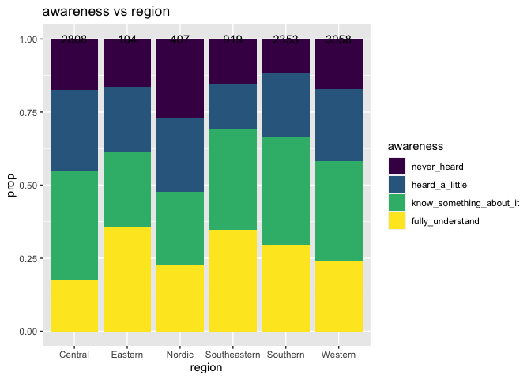
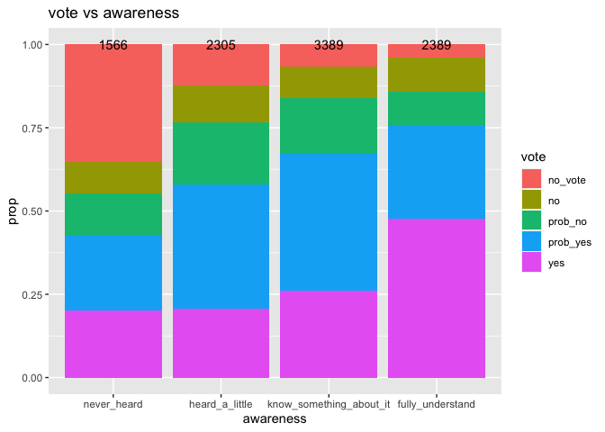

<style type="text/css">
.main-container {
  max-width: 1800px;
  margin-left: auto;
  margin-right: auto;
}
</style>


## Basic Income Analysis
The goal is to extract knowledge on what factors are possibly associated with the opinions on basic income, based on a dataset provided by Dalia Research's poll on basic income in European countries in 2016. Specifically, the aim of this project is to gain knowledge about the follwing topics:
<ol>
  <li>How awareness of BI is associated with socio-economic factors</li>
  <li>How the thoughts on the effects of BI is associated with socio-economic factors</li>
  <li>Whether there is an association between awareness and whether a person would vote for BI</li>
  <li>How awareness is related to thoughts on the effects </li>
  <li>What makes a respondent be for or be against BI </li>
</ol>

### Import libraries

```r
library(tidyverse)
library(MASS)
library(nnet)
library(scales)
library(GGally)
```

### Import data

```r
df = read.csv("basic_income_dataset_dalia.csv")
```

### Define Functions which are going to be used for data preprocesing and other tasks

```r
length_sum = function(lst){
  return(lst %>%
           sapply(function(x) return(length(x))) %>%
           sum())
}

string_to_lst = function(strings){
  lst = strings %>% sapply(function(st){
    return(strsplit(x=as.character(st), split = " | ", fixed=TRUE))
  })
  return(lst)
}

indicator_category = function(strings, category){
  lst = string_to_lst(strings)
  indicator = rep(0, length(lst))
  for(i in 1:length(lst)){
    if(category %in% lst[[i]]) indicator[i]=1 
  }
  return(indicator)
}

unique_strings = function(strings){
  lst = string_to_lst(strings)
  dat_vec = character(length = length_sum(lst))
  ind = 1
  for(i in 1:length(lst)){
    for(j in 1:length(lst[[i]])){
      dat_vec[ind] = lst[[i]][j]
      ind = ind + 1
    }
  }
  return(unique(dat_vec))
}

pie_chart_generator = function(var_name, facet_col="none", title){
  p = ggplot(df, aes_string(x=factor(1), fill=var_name)) +
    geom_bar(width=1, position = "fill") +
    labs(title=title) +
    coord_polar(theta="y") +
  theme(
    axis.title.x = element_blank(),
    axis.title.y = element_blank(),
    axis.ticks.x = element_blank(),
    axis.ticks.y = element_blank(),
    plot.margin = unit(c(0.1,0.1,0.1,0.1), "mm")
  ) +
    scale_y_continuous(breaks=c(0, 0.25, 0.5, 0.75),
                       labels=percent) 
  if(facet_col %in% colnames(df)){
    if(class(df[,facet_col])=="factor") p = p + facet_grid(reformulate(facet_col, "."))
  }
  return(p)
}

bar_prop_generator = function(fill_var, x_var, title, with_n=TRUE, facet_col="none"){
  p = ggplot(df, aes_string(x=x_var)) + 
      geom_bar(aes_string(fill=fill_var), position="fill") +
      geom_text(aes(label=..count..), stat = "count", position = "fill") +
      labs(title=title, y="prop")
  if(facet_col %in% colnames(df)){
    if(class(df[,facet_col])=="factor") p = p + facet_grid(reformulate(facet_col, "."))
  }
  return(p)
}

reason_plots = function(for_or_against = "for"){
  with_parenthesis = sprintf(" (%s)", for_or_against) 
  vars = colnames(df)[grep(with_parenthesis, colnames(df), fixed=TRUE)]
  reasons_stat = df[,vars] %>% 
    apply(2,sum) %>%
    data.frame()
  colnames(reasons_stat) = "n"
  reasons_stat$reason = rownames(reasons_stat) %>%
   sapply(function(x) return(sub(with_parenthesis, "", x, fixed=TRUE)))
  rownames(reasons_stat) = 1:nrow(reasons_stat)
  num_none_of_the_above = reasons_stat$n[reasons_stat$reason=="None of the above"]
  num_not_none_of_the_above = nrow(df) - num_none_of_the_above
  whether_there_are_reasons = 
    data.frame(response=c("yes", "no"),
              n = c(num_not_none_of_the_above, num_none_of_the_above))
  reasons_stat$prop = reasons_stat$n / num_not_none_of_the_above
  reasons_stat = reasons_stat[,c("reason", "n", "prop")]
  
  plot1 = whether_there_are_reasons %>%
    ggplot(aes(x=response, y=n)) +
    geom_bar(stat="identity") +
    labs(title=sprintf("Number of respondents who did/ did not gave at least one reason for being %s BI", for_or_against))
  
  plot2 = reasons_stat %>%
    ggplot(aes(x=reorder(reason, prop), y=prop)) +
    geom_bar(stat="identity") +
    labs(x="reason", title=sprintf("Reasons for being %s BI", for_or_against)) +
    coord_flip()
  
  return(list(plot1, plot2))
}
```

### Take a quick look at the data
#### Dimension of dataset

```r
dim(df)
```

```
## [1] 9649   15
```

#### Names of Columns

```r
colnames(df)
```

```
##  [1] "country_code"                                        "uuid"                                                "age"                                                 "gender"                                              "rural"                                               "dem_education_level"                                 "dem_full_time_job"                                   "dem_has_children"                                    "question_bbi_2016wave4_basicincome_awareness"        "question_bbi_2016wave4_basicincome_vote"             "question_bbi_2016wave4_basicincome_effect"           "question_bbi_2016wave4_basicincome_argumentsfor"     "question_bbi_2016wave4_basicincome_argumentsagainst" "age_group"                                           "weight"
```

Since columns related to opinions each have a long name, they can be shortened.

```r
c_name_responses = c("awareness", "vote", "effect", "arguments_for",
           "arguments_against")
colnames(df)[9:13] = c_name_responses
colnames(df)
```

```
##  [1] "country_code"        "uuid"                "age"                 "gender"              "rural"               "dem_education_level" "dem_full_time_job"   "dem_has_children"    "awareness"           "vote"                "effect"              "arguments_for"       "arguments_against"   "age_group"           "weight"
```

#### Take a look at the data

```r
for(i in 1:ncol(df)){
  cat("\n----", colnames(df)[i], "---- \n")
  for(j in 1:5){
     cat("   ", as.character(df[j, i]), "\n")
  }
}
```

```
## 
## ---- country_code ---- 
##     AT 
##     AT 
##     AT 
##     AT 
##     AT 
## 
## ---- uuid ---- 
##     f6e7ee00-deac-0133-4de8-0a81e8b09a82 
##     54f0f1c0-dda1-0133-a559-0a81e8b09a82 
##     83127080-da3d-0133-c74f-0a81e8b09a82 
##     15626d40-db13-0133-ea5c-0a81e8b09a82 
##     24954a70-db98-0133-4a64-0a81e8b09a82 
## 
## ---- age ---- 
##     61 
##     57 
##     32 
##     45 
##     41 
## 
## ---- gender ---- 
##     male 
##     male 
##     male 
##     male 
##     female 
## 
## ---- rural ---- 
##     rural 
##     urban 
##     urban 
##     rural 
##     urban 
## 
## ---- dem_education_level ---- 
##     no 
##     high 
##     NA 
##     high 
##     high 
## 
## ---- dem_full_time_job ---- 
##     no 
##     yes 
##     no 
##     yes 
##     yes 
## 
## ---- dem_has_children ---- 
##     no 
##     yes 
##     no 
##     yes 
##     yes 
## 
## ---- awareness ---- 
##     I know something about it 
##     I understand it fully 
##     I have heard just a little about it 
##     I have heard just a little about it 
##     I have heard just a little about it 
## 
## ---- vote ---- 
##     I would not vote 
##     I would probably vote for it 
##     I would not vote 
##     I would probably vote for it 
##     I would probably vote for it 
## 
## ---- effect ---- 
##     None of the above 
##     A basic income would not affect my work choices 
##     ‰Û_ gain additional skills 
##     ‰Û_ work less 
##     None of the above 
## 
## ---- arguments_for ---- 
##     None of the above 
##     It increases appreciation for household work and volunteering | It encourages financial independence and self-responsibility | It reduces anxiety about financing basic needs 
##     It creates more equality of opportunity 
##     It reduces anxiety about financing basic needs 
##     It reduces anxiety about financing basic needs 
## 
## ---- arguments_against ---- 
##     None of the above 
##     It might encourage people to stop working 
##     Foreigners might come to my country and take advantage of the benefit 
##     None of the above 
##     It is impossible to finance | It might encourage people to stop working | It increases dependence on the state 
## 
## ---- age_group ---- 
##     40_65 
##     40_65 
##     26_39 
##     40_65 
##     40_65 
## 
## ---- weight ---- 
##     1.105.534.474 
##     1.533.248.826 
##     0.9775919155 
##     1.105.534.474 
##     58.731.136
```

It seems values of response-related variables can be fixed so that the values are not too long and reflect, for arguments_for and argements_against columns, 
the fact that those are based on multiple choices of opinions.

### Preprecessing
#### Check for missingness

```r
df %>%
  apply(2, function(x) sum(is.na(x)))
```

```
##        country_code                uuid                 age              gender               rural dem_education_level   dem_full_time_job    dem_has_children           awareness                vote              effect       arguments_for   arguments_against           age_group              weight 
##                   0                   0                   0                   0                   0                 663                   0                   0                   0                   0                   0                   0                   0                   0                   0
```

Only education level has missing values. For now, let the missing values for this variable be treated as "unknown".


```r
df$dem_education_level = as.character(df$dem_education_level)
df$dem_education_level[is.na(df$dem_education_level)] = "unknown"
df$dem_education_level = factor(df$dem_education_level,
                                   levels=c("unknown", "no", "low", "medium", "high"))
```


#### awareness
Based on the unique values in the awareness column, shown below, values can be renamed so they are not too long and have no spaces.

```r
unique(df$awareness)
```

```
## [1] I know something about it           I understand it fully               I have heard just a little about it I have never heard of it           
## Levels: I have heard just a little about it I have never heard of it I know something about it I understand it fully
```

```r
df$awareness = df$awareness %>%
  sapply(function(x){
    if(x == "I understand it fully"){return("fully_understand")}
    else if(x == "I know something about it"){return("know_something_about_it")}
    else if(x=="I have heard just a little about it"){return("heard_a_little")}
    else{return("never_heard")}
  }) %>%
  factor(levels=c("never_heard", "heard_a_little" , "know_something_about_it", "fully_understand" ))
```

#### Vote

```r
###vote###
unique(df$vote)
```

```
## [1] I would not vote                 I would probably vote for it     I would vote against it          I would vote for it              I would probably vote against it
## Levels: I would not vote I would probably vote against it I would probably vote for it I would vote against it I would vote for it
```

```r
df$vote = df$vote %>%
sapply(function(x){
  if(x == "I would vote for it"){return("yes")}
  else if(x == "I would probably vote for it"){return("prob_yes")}
  else if(x=="I would probably vote against it"){return("prob_no")}
  else if(x=="I would vote against it"){return("no")}
  else{return("no_vote")}
}) %>%
  factor(levels=c("no_vote", "no", "prob_no", "prob_yes", "yes"))
```

#### effect
For this variable, the letters "‰Û_ " are included in some of the observations, which are not neccesary and can be removed.

```r
unique(df$effect)
```

```
## [1] None of the above                               A basic income would not affect my work choices ‰Û_ gain additional skills                      ‰Û_ work less                                   ‰Û_ work as a freelancer                        ‰Û_ do more volunteering work                   ‰Û_ stop working                                ‰Û_ spend more time with my family              ‰Û_ look for a different job                   
## Levels: ‰Û_ do more volunteering work ‰Û_ gain additional skills ‰Û_ look for a different job ‰Û_ spend more time with my family ‰Û_ stop working ‰Û_ work as a freelancer ‰Û_ work less A basic income would not affect my work choices None of the above
```

```r
df$effect = df$effect %>% sapply(function(x){
  x = as.character(x)
  sub("‰Û_ ", "", x, fixed=TRUE)
}) %>%
  factor()
```

#### arguments_for and arguments_against
For arguments_for and arguments_against, since the values are based on a multiple choice with each of the chosen options separated by the character "|", columns for each option can be created so that for each of the respondents, a cell in a column corresponding to one of the choice options takes 1 if that option is checked and 0 otherwise.

```r
###arguments_for###
arguments_for_unique = df$arguments_for %>% 
  unique_strings()
for(i in 1:length(arguments_for_unique)){
  df[paste(arguments_for_unique[i], "(for)")] = df$arguments_for %>% 
     indicator_category(category = paste(arguments_for_unique[i]))
}

###arguments_against###
arguments_against_unique = df$arguments_against %>% 
  unique_strings()
for(i in 1:length(arguments_against_unique)){
  df[paste(arguments_against_unique[i], "(against)")] = df$arguments_against %>% 
    indicator_category(category = paste(arguments_against_unique[i]))
}
```

Now, the columns arguments_for and arguments_against can be deleted

```r
df = df[setdiff(colnames(df), c("arguments_for", "arguments_against"))]
```

### Fix factor orderings
For factor variables with more than 2 levels, levels can be possibly reordered.

#### Create country column
Regarding the country, since there is only a variable for country code, creating a culumn for the country name based on the code could help in making visualization clear in meaning.

```r
df$country_code %>% unique()
```

```
##  [1] AT BE BG CY CZ DE DK EE ES FI FR GB GR HR HU IE IT LT LU LV MT NL PL PT RO SE SI SK
## Levels: AT BE BG CY CZ DE DK EE ES FI FR GB GR HR HU IE IT LT LU LV MT NL PL PT RO SE SI SK
```

```r
map_code_name = list(
  AT = "Austria", BE = "Belgium", BG = "Bulgaria",
  CY = "Cyprus", CZ = "Czechia", DE = "Germany",
  DK = "Denamrk", EE = "Estonia", ES = "Spain",
  FI = "Finland", FR = "France", GB = "Britain",
  GR = "Greece", HR = "Croatia", HU = "Hungary",
  IE = "Ireland", IT = "Italy", LT = "Lithuania",
  LU = "Luxembourg", LV = "Latvia", MT = "Malta",
  NL = "Netherlands", PL = "Poland", PT = "Portugal",
  RO = "Romania", SE = "Sweden", SI = "Slovenia",
  SK = "Slovenia"
)
df$country = sapply(df$country_code, function(x)
  return(map_code_name[[as.character(x)]])) %>% 
  as.factor()
```

In addition to this, countries can be divided based on region.

```r
map_code_region = list(
  AT = "Central", BE = "Western", BG = "Southeastern",
  CY = "Southeastern", CZ = "Central", DE = "Central",
  DK = "Nordic", EE = "Eastern", ES = "Southern",
  FI = "Nordic", FR = "Western", GB = "Western",
  GR = "Southeastern", HR = "Southeastern", HU = "Central",
  IE = "Western", IT = "Southern", LT = "Eastern",
  LU = "Western", LV = "Eastern", MT = "Southern",
  NL = "Western", PL = "Central", PT = "Southern",
  RO = "Southeastern", SE = "Nordic", SI = "Southeastern",
  SK = "Southeastern"
)
df$region = sapply(df$country_code, function(x)
  return(map_code_region[[as.character(x)]])) %>% 
  as.factor()
```

Now take a look at the first six rows again

```r
for(i in 1:ncol(df)){
  cat("----", colnames(df)[i], "---- \n  ")
  for(j in 1:5){
     cat(as.character(df[j, i]), ",")
  }
  cat(as.character(df[6, i]), "\n\n")
}
```

```
## ---- country_code ---- 
##   AT ,AT ,AT ,AT ,AT ,AT 
## 
## ---- uuid ---- 
##   f6e7ee00-deac-0133-4de8-0a81e8b09a82 ,54f0f1c0-dda1-0133-a559-0a81e8b09a82 ,83127080-da3d-0133-c74f-0a81e8b09a82 ,15626d40-db13-0133-ea5c-0a81e8b09a82 ,24954a70-db98-0133-4a64-0a81e8b09a82 ,28583060-dbe2-0133-ff9c-0a81e8b09a82 
## 
## ---- age ---- 
##   61 ,57 ,32 ,45 ,41 ,26 
## 
## ---- gender ---- 
##   male ,male ,male ,male ,female ,female 
## 
## ---- rural ---- 
##   rural ,urban ,urban ,rural ,urban ,rural 
## 
## ---- dem_education_level ---- 
##   no ,high ,unknown ,high ,high ,high 
## 
## ---- dem_full_time_job ---- 
##   no ,yes ,no ,yes ,yes ,yes 
## 
## ---- dem_has_children ---- 
##   no ,yes ,no ,yes ,yes ,no 
## 
## ---- awareness ---- 
##   know_something_about_it ,fully_understand ,heard_a_little ,heard_a_little ,heard_a_little ,fully_understand 
## 
## ---- vote ---- 
##   no_vote ,prob_yes ,no_vote ,prob_yes ,prob_yes ,no 
## 
## ---- effect ---- 
##   None of the above ,A basic income would not affect my work choices ,gain additional skills ,work less ,None of the above ,A basic income would not affect my work choices 
## 
## ---- age_group ---- 
##   40_65 ,40_65 ,26_39 ,40_65 ,40_65 ,26_39 
## 
## ---- weight ---- 
##   1.105.534.474 ,1.533.248.826 ,0.9775919155 ,1.105.534.474 ,58.731.136 ,0.6888730839 
## 
## ---- None of the above (for) ---- 
##   1 ,0 ,0 ,0 ,0 ,0 
## 
## ---- It increases appreciation for household work and volunteering (for) ---- 
##   0 ,1 ,0 ,0 ,0 ,0 
## 
## ---- It encourages financial independence and self-responsibility (for) ---- 
##   0 ,1 ,0 ,0 ,0 ,1 
## 
## ---- It reduces anxiety about financing basic needs (for) ---- 
##   0 ,1 ,0 ,1 ,1 ,1 
## 
## ---- It creates more equality of opportunity (for) ---- 
##   0 ,0 ,1 ,0 ,0 ,0 
## 
## ---- It reduces bureaucracy and administrative expenses (for) ---- 
##   0 ,0 ,0 ,0 ,0 ,0 
## 
## ---- It increases solidarity, because it is funded by everyone (for) ---- 
##   0 ,0 ,0 ,0 ,0 ,0 
## 
## ---- None of the above (against) ---- 
##   1 ,0 ,0 ,1 ,0 ,0 
## 
## ---- It might encourage people to stop working (against) ---- 
##   0 ,1 ,0 ,0 ,1 ,1 
## 
## ---- Foreigners might come to my country and take advantage of the benefit (against) ---- 
##   0 ,0 ,1 ,0 ,0 ,0 
## 
## ---- It is impossible to finance (against) ---- 
##   0 ,0 ,0 ,0 ,1 ,1 
## 
## ---- It increases dependence on the state (against) ---- 
##   0 ,0 ,0 ,0 ,1 ,0 
## 
## ---- It is against the principle of linking merit and reward (against) ---- 
##   0 ,0 ,0 ,0 ,0 ,1 
## 
## ---- Only the people who need it most should get something from the state (against) ---- 
##   0 ,0 ,0 ,0 ,0 ,0 
## 
## ---- country ---- 
##   Austria ,Austria ,Austria ,Austria ,Austria ,Austria 
## 
## ---- region ---- 
##   Central ,Central ,Central ,Central ,Central ,Central
```
Now, the dataset is in a more analyzable form.

## EDA

### Respondents' countries

```r
df %>% 
  group_by(by=country) %>%
  summarise(n=n()) %>% 
  ggplot(aes(x=reorder(by, n), y=n)) +
  geom_bar(stat="identity") +
  xlab("Country") +
  coord_flip() 
```

```
## `summarise()` ungrouping output (override with `.groups` argument)
```

<!-- -->


### education levels

```r
df %>% 
  group_by(by=dem_education_level) %>%
  summarise(n=n()) %>% 
  ggplot(aes(x=by, y=n)) +
  geom_bar(stat="identity") +
  xlab("Education Level") 
```

```
## `summarise()` ungrouping output (override with `.groups` argument)
```

<!-- -->

### education levels and full time job for each gender

```r
bar_prop_generator("dem_full_time_job", "gender", "dem_full_time_job", with_n=TRUE, facet_col="none")
```

<!-- -->


### Awareness

```r
df %>% 
  group_by(by=awareness) %>%
  summarise(n=n()) %>% 
  ggplot(aes(x=by, y=n)) +
  geom_bar(stat="identity") +
  xlab("Awareness") 
```

```
## `summarise()` ungrouping output (override with `.groups` argument)
```

<!-- -->

Based on the fact that the majority of the survey respondents fall in either the category "fully_understand"or "know_something_about_it", it seems that, despite the possibility that the awareness is highly dependent on other variables, including social status and political and ecnonomic attributes of a region, BI is overall a well-known idea at least to some extent.

### Vote

```r
df %>% 
  group_by(by=vote) %>%
  summarise(n=n()) %>% 
  ggplot(aes(x=by, y=n)) +
  geom_bar(stat="identity") +
  xlab("vote") 
```

```
## `summarise()` ungrouping output (override with `.groups` argument)
```

<!-- -->

It can be seen that a majority of respondents of the survey at least probably would vote for BI. Again, this could be dependent on the social status of a respondent, political or economic attributes of the region they reside in, etc.

### Reasons for for

```r
for_plots = reason_plots()
for_plots[[1]]
```

<!-- -->

```r
for_plots[[2]]
```

<!-- -->

From the above plots, a number of people seem to think BI reduces financial anxiety.

### Reasons for against

```r
against_plots = reason_plots("against")
against_plots[[1]]
```

<!-- -->

```r
against_plots[[2]]
```

<!-- -->

From the above plots, it can be seen that for vast majority of people, there is at least one reason for being against BI in the answer choices.

### Effect

```r
df %>%
  group_by(by=effect) %>%
  summarise(n=n()) %>%
  ggplot(aes(x=reorder(by, n), y=n)) +
  geom_bar(stat="identity") +
  labs(title="Opinions on effects",
       x="choice") +
  coord_flip() 
```

```
## `summarise()` ungrouping output (override with `.groups` argument)
```

<!-- -->

It seems that many of the respondents think BI would not lead to job loss, and few people think BI would make them stop working.

## Answering quastions
### 1. How social status is related to whether a person knows about BI
Whether a respondent knows about BI corresponds to the variable awareness. The variable awareness can be considered an ordinal variable with the categories, "never_heard", "heard_a_little", "know_something_about_it", and "fully_understand".
Firstly, let's explore this topic through grapshs.

### Graphical Analysis
#### Vs regrion

```r
bar_prop_generator("awareness", "region", "awareness vs education level")
```

<!-- -->

##### Plot awareness vs eduction level

```r
bar_prop_generator("awareness", "dem_education_level", "awareness vs education level")
```

<!-- -->

Despite slight differences, people who have a high education level on average are more knowledgeable in BI. Let's partition by whether the resident is from a rural or urban area.


```r
bar_prop_generator("awareness", "dem_education_level", "awareness vs education level by rural", 
                   facet_col = "rural")
```

<!-- -->

It seems the trend seems overall not that different, and that whether a person lives in a rural area does not confound the relationship between the education level and the level of awareness. For urban resiednts, however, a respondent from an urban area with "no" education level are more likely to not have heard about BI than a same type of respondent from a rural area. 

##### plot vs age group

```r
bar_prop_generator("awareness", "age_group", "awareness vs age group")
```

<!-- -->

Slightly, people belonging to older age groups seem to tend to be more knowledgeable in BI.

#### Modelling
Since the level of awareness can be considered an ordered categorical variable, a cumulative logit model can be suitable. The coefficients of the model can be too complex to interpret. One of the possible ways to mitigate this possible problem is to have a proportional odds assumption, in which the coefficient for each level only differs by the intercept term. A model with this assumption and without it can be compared based on a certain metric. Since the models are nested, AIC can be used as the metric.

##### Multinomial logit model

```r
reg_formula_generator = function(output, predictors){
  
  formula_right = paste(predictors, collapse=" + ")
  formula = paste(output, formula_right, sep = " ~ ")
  
  return(as.formula(formula))
}

explanatory_vars = c("age_group", "region", "gender", "rural", 
                     "dem_education_level", "dem_full_time_job", "dem_has_children")
output_var = "awareness"

#Prop odds
mod_po = polr(reg_formula_generator(output_var, explanatory_vars),
           data=df, Hess=TRUE)

#Non-prop odds
```


Since the goal is to see what factors are related to the level of awareness, another way to infer this is to fit a Random Forest classifier and see the importance measure of each explanatory variable considered, based on the mean decrease in Gini coef.

```r
library(randomForest)
```

```
## randomForest 4.6-14
```

```
## Type rfNews() to see new features/changes/bug fixes.
```

```
## 
## Attaching package: 'randomForest'
```

```
## The following object is masked from 'package:dplyr':
## 
##     combine
```

```
## The following object is masked from 'package:ggplot2':
## 
##     margin
```

```r
explanatory_vars = c("age_group", "region", "gender", "rural", 
                     "dem_education_level", "dem_full_time_job", "dem_has_children")
rf = randomForest::randomForest(x=df[explanatory_vars], y=df$awareness, ntree=5000)
rf$importance
```

```
##                     MeanDecreaseGini
## age_group                   64.03918
## region                     121.40638
## gender                      39.21982
## rural                       38.75536
## dem_education_level        118.93772
## dem_full_time_job           39.39088
## dem_has_children            36.22627
```

Based on the importance measures above, education level and region might be related to the level of awareness more than other variables in the dataset. 

### 2. How notion on the effects of BI is associated with social status
#### Graphical Analysis
##### Plot 

```r
bar_prop_generator("effect", "age_group", "effect vs age group", facet_col="gender")
```

<!-- -->


```r
bar_prop_generator("effect", "dem_education_level", "effect vs age group")
```

<!-- -->


##### Modelling
Since there are many choices for the effects, a multinomial logit model would be too complex to interpret. 


```r
mod_effect = multinom(effect ~ age_group + gender + rural + region + dem_education_level + dem_full_time_job +  dem_has_children,
                      data=df, trace=FALSE)
mod_effect
```

```
## Call:
## multinom(formula = effect ~ age_group + gender + rural + region + 
##     dem_education_level + dem_full_time_job + dem_has_children, 
##     data = df, trace = FALSE)
## 
## Coefficients:
##                                (Intercept) age_group26_39 age_group40_65  gendermale  ruralurban regionEastern  regionNordic regionSoutheastern regionSouthern regionWestern dem_education_levelno dem_education_levellow dem_education_levelmedium dem_education_levelhigh dem_full_time_jobyes dem_has_childrenyes
## do more volunteering work       -0.9593504    -0.35839868     -0.5221405 -0.07680663  0.28519510     0.2772222  0.0005344373        0.303233205      0.2623311    0.23723129            0.17124558           -0.512682381               -0.51316763              -0.6192763          -0.19264730         -0.18973294
## gain additional skills          -0.7317274     0.07648363     -0.4633992  0.04573123  0.22834161     0.4459720  0.0172769906       -0.036317078     -0.4305239    0.17623571            0.11575434           -0.007651468               -0.20229833              -0.3618546          -0.11179805         -0.34236014
## look for a different job        -1.2070461    -0.13838798     -0.4951532 -0.04083968  0.10289376     0.6068405 -0.3476427180        0.063987669      0.1978584    0.52885673            0.33843076           -0.354832799               -0.53299419              -0.6869383           0.20879307         -0.10957515
## None of the above                0.3797631    -0.16468140     -0.3313063  0.01109778 -0.04146981     0.5647496 -0.0445491163       -0.000726233     -0.2154989    0.34518816            0.18147779           -0.686681779               -1.12931939              -1.3856189          -0.32821004         -0.11129495
## spend more time with my family  -0.4037322    -0.16994711     -0.7436910  0.03483688  0.14393694     0.6688693 -0.3945521890       -0.061937256     -0.3089594    0.04832668            0.05651460           -0.108380463               -0.41683316              -0.5747031           0.07435489          0.42516063
## stop working                    -1.6864155    -0.31463897     -0.7679944  0.23948594  0.22981665     0.1478993  0.1690415835       -0.416160856     -0.2619736   -0.18578389            0.55211192           -0.047346288               -0.25399099              -0.2592496           0.01902249         -0.04454982
## work as a freelancer            -1.9618438    -0.11612019     -0.4519677  0.20344939  0.19323875     0.4837884  0.4128772273        0.367590072      0.1233275    0.01841245           -0.05325097            0.093892641                0.09385219               0.3389524          -0.31587922         -0.18796436
## work less                       -1.2421554    -0.44133454     -0.6948525  0.15633558  0.14005166     0.7117279  0.2749377760       -0.318191389     -0.5338769    0.02513800            0.59743706           -0.141480891               -0.18246775              -0.2789970           0.35625948         -0.10976545
## 
## Residual Deviance: 36683.49 
## AIC: 36939.49
```


```r
explanatory_vars = c("age_group", "region", "gender", "rural", 
                     "dem_education_level", "dem_full_time_job", "dem_has_children")
library(randomForest())
rf_effect = randomForest(x= df[explanatory_vars], y=df$effect, ntree = 1000)
rf_effect$importance
```

```
##                     MeanDecreaseGini
## age_group                   73.01763
## region                     110.61747
## gender                      43.27664
## rural                       40.20600
## dem_education_level        109.37243
## dem_full_time_job           38.95282
## dem_has_children            38.53826
```

### 3. Whether there is an association between awareness and whether a person would vote for BI
#### graphical Analysis

```r
bar_prop_generator("vote", "awareness", "vote vs awareness")
```

<!-- -->

The above plot shows that the more knowledge one has about BI, the more likely he would vote for BI. It cna be inferred from the above plot that the vote and awareness are not independent or homogeneous, let's do Chi square test for independence

#### Chi-square test

```r
chisq.test(x=df$vote, y=df$awareness)
```

```
## 
## 	Pearson's Chi-squared test
## 
## data:  df$vote and df$awareness
## X-squared = 1519.5, df = 12, p-value < 2.2e-16
```

#### Correspondence analysis

```r
library(FactoMineR)
library(factoextra)
```

```
## Welcome! Want to learn more? See two factoextra-related books at https://goo.gl/ve3WBa
```

```r
table_awareness_vote = table(df$awareness, df$vote)
CA(table_awareness_vote)
```

<!-- -->

```
## **Results of the Correspondence Analysis (CA)**
## The row variable has  4  categories; the column variable has 5 categories
## The chi square of independence between the two variables is equal to 1519.526 (p-value =  2.324287e-318 ).
## *The results are available in the following objects:
## 
##    name              description                   
## 1  "$eig"            "eigenvalues"                 
## 2  "$col"            "results for the columns"     
## 3  "$col$coord"      "coord. for the columns"      
## 4  "$col$cos2"       "cos2 for the columns"        
## 5  "$col$contrib"    "contributions of the columns"
## 6  "$row"            "results for the rows"        
## 7  "$row$coord"      "coord. for the rows"         
## 8  "$row$cos2"       "cos2 for the rows"           
## 9  "$row$contrib"    "contributions of the rows"   
## 10 "$call"           "summary called parameters"   
## 11 "$call$marge.col" "weights of the columns"      
## 12 "$call$marge.row" "weights of the rows"
```


```r
#head(df)
```

### 4. How awareness is related to thoughts on the effects
#### Graphical Analysis

```r
bar_prop_generator("effect", "awareness", "vote vs awareness")
```

<!-- -->

It can be seen that those who says they understand BI tend to have the opinion that BI would not affect their work choices. Based on this observations, people knowledgeable about BI might tend to be more optimistic about the BI's effects.

#### Chi square test

```r
chisq.test(x=df$effect, y=df$awareness)
```

```
## 
## 	Pearson's Chi-squared test
## 
## data:  df$effect and df$awareness
## X-squared = 728.72, df = 24, p-value < 2.2e-16
```


#### Correspondence analysis

```r
table_awareness_effect = table(df$effect, df$awareness)
CA(table_awareness_effect)
```

<!-- -->

```
## **Results of the Correspondence Analysis (CA)**
## The row variable has  9  categories; the column variable has 4 categories
## The chi square of independence between the two variables is equal to 728.718 (p-value =  2.237916e-138 ).
## *The results are available in the following objects:
## 
##    name              description                   
## 1  "$eig"            "eigenvalues"                 
## 2  "$col"            "results for the columns"     
## 3  "$col$coord"      "coord. for the columns"      
## 4  "$col$cos2"       "cos2 for the columns"        
## 5  "$col$contrib"    "contributions of the columns"
## 6  "$row"            "results for the rows"        
## 7  "$row$coord"      "coord. for the rows"         
## 8  "$row$cos2"       "cos2 for the rows"           
## 9  "$row$contrib"    "contributions of the rows"   
## 10 "$call"           "summary called parameters"   
## 11 "$call$marge.col" "weights of the columns"      
## 12 "$call$marge.row" "weights of the rows"
```

### 5. What are the possible reasons for a respondent to not vote for BI
The columns for the reasons for being for/against the BI along with the variable vote.
In order to simplify analysis, the levels for vote can be collapsed into two levels, "Yes", which includes the levels "yes" and "prob_yes" in the original formulation, and "No", which includes "no" and "prob_no".

Since the goal is to see what factors possibly would make a person vote for or against BI, not to make a model for precise predictions, the rows with the label for the vote "no_vote" can be discarded

There can be loss of information by doing the above things. However, this leads to the reduction of number of the levels down to 2, which then enables us to fit a binary logistic regression, in which the interpretation of coefficients is much simpler than when there are more than 2 levels.


